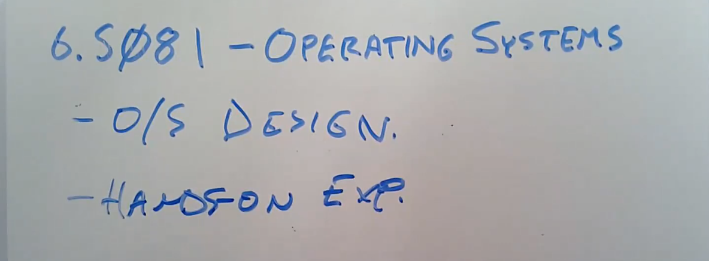

# 1.1 课程内容简介

大家好，欢迎来到6.S081 --- 操作系统这门课程。我的名字叫Robert，我会与Frans一起讲这门课。David，Nicholas会作为这门课程的助教。在我们在线授课的过程中，请尽情提问。你可以直接语音打断我，或者通过聊天窗口提问，我们工作人员会关注聊天窗口。顺便说一下，我们也会通过视频录制这门课程，之后我们会通过网络发布视频，这样方便你复习，对于没能参加课程的同学也可以通过视频观看。

接下来我想从列出这门课程的目标来开始。这门课程的目标有：

1. 理解操作系统的设计和实现。设计是指整体的结构，实现是指具体的代码长什么样。对于这两者，我们都会花费大量时间讲解。
2. 为了深入了解具体的工作原理，你们可以通过一个小的叫做XV6的操作系统，获得实际动手经验。通过研究现有的操作系统，并结合课程配套的实验，你可以获得扩展操作系统，修改并提升操作系统的相关经验，并且能够通过操作系统接口，编写系统软件。

