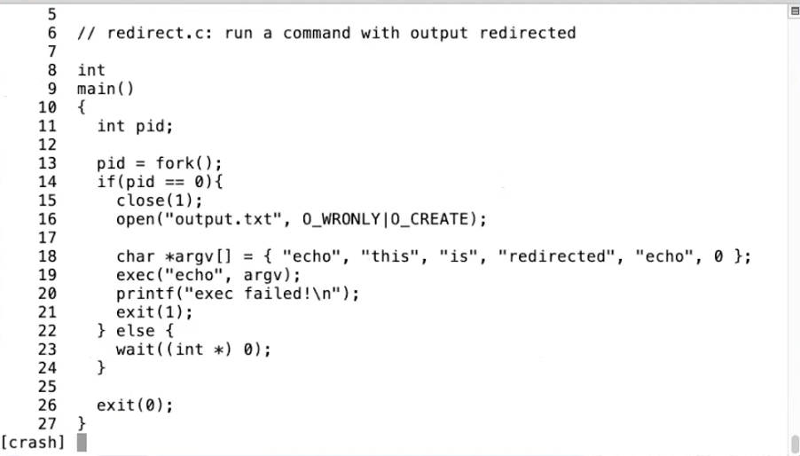

# 1.10 I/O Redirect

最后一个例子，我想展示一下将所有这些工具结合在一起，来实现I/O重定向。

的意义是，我们希望文件描述符1指向一个其他的位置。也就是说，在子进程中，我们不想使用原本指向console输出的文件描述符1。

代码第16行的open一定会返回1，因为open会返回当前进程未使用的最小文件描述符序号。因为我们刚刚关闭了文件描述符1，而文件描述符0还对应着console的输入，所以open一定可以返回1。在代码第16行之后，文件描述符1与文件output.txt关联。

之后我们执行exec(echo)，echo会输出到文件描述符1，也就是文件output.txt。这里有意思的地方是，echo根本不知道发生了什么，echo也没有必要知道I/O重定向了，它只是将自己的输出写到了文件描述符1。只有Shell知道I/O重定向了。

这个例子同时也演示了分离fork和exec的好处。fork和exec是分开的系统调用，意味着在子进程中有一段时间，fork返回了，但是exec还没有执行，子进程仍然在运行父进程的指令。所以这段时间，尽管指令是运行在子进程中，但是这些指令仍然是父进程的指令，所以父进程仍然可以改变东西，直到代码执行到了第19行。这里fork和exec之间的间隔，提供了Shell修改文件描述符的可能。

对于这里的redirect例子，有什么问题吗？

（沉默了一会）

好吧，我们时间快到了，我来总结一下。我们这节课：

* 看了一些Unix I/O和进程的接口和抽象。这里需要记住的是，接口是相对的简单，你只需要传入表示文件描述符的整数，和进程ID作为参数给相应的系统调用。而接口内部的实现逻辑相对来说是复杂的，比如创建一个新的进程，拷贝当前进程。
* 除此之外，我还展示了一些例子。通过这些例子你可以看到，尽管接口本身是简单的，但是可以将多个接口结合起来形成复杂的用例。比如说创建I/O重定向。

在下周结束之前，需要完成一个实验，这个实验中涉及更多类似于我们课堂上讲的简单小工具。好好做实验，我们下周再见。
