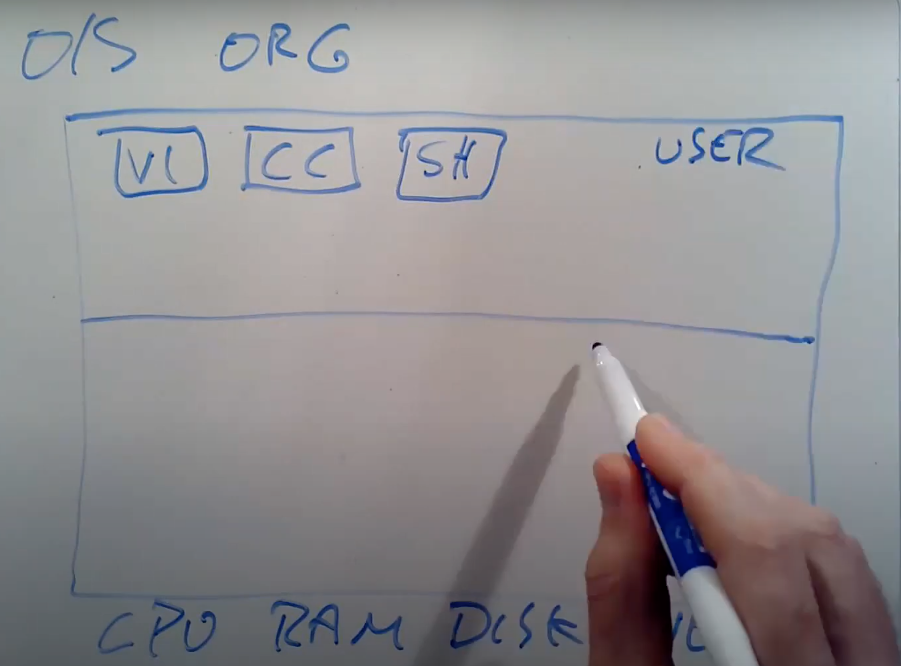

# 1.2 操作系统结构

过去几十年，人们将一些分层的设计思想加入到操作系统中，并运行的很好。我将会为你列出操作系统经典的组织结构，这个组织结构同时也是这门课程的主要内容，这里的组织结构对于操作系统来说还是挺常见的。

这里实际上就是操作系统内部组成，当我想到这里的组织结构时，我首先会想到用一个矩形表示一个计算机，这个计算机有一些硬件资源，我会将它放在矩形的下面，硬件资源包括了CPU，内存，磁盘，网卡。所以硬件资源在最低一层。

在这个架构的最上层，我们会运行各种各样的应用程序，或许有一个文本编辑器（VI），或许有一个C编译器（CC），你还可以运行大量我们今天会讨论的其他事物，例如作为CLI存在的Shell，所以这些就是正在运行的所有程序。这里程序都运行在同一个空间中，这个空间通常会被称为用户空间（Userspace）。

