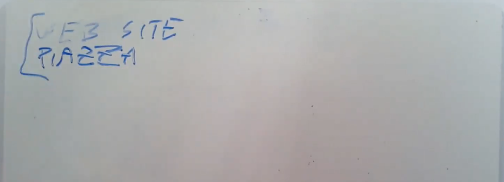

# 1.4 课程结构和资源

接下来，我将花几分钟来介绍6.s081这门课程的结构，之后我们再来介绍具体的技术内容。

课程有一个网站，可以通过google查询6.s081找到。网站上会有课程的计划，lab的内容，课程结构的信息，例如最后是怎么打分的。

另一个资源是Piazza，它主要用来做两件事情，第一件是人们可以在上面咨询有关lab的问题，助教们会尝试回答这些问题，但是你们也可以彼此回答问题；第二件是上面会有课程相关的通知，我们会把通知发上去，所以你应该时不时关注Piazza，即使你不使用它寻求实验的帮助。

