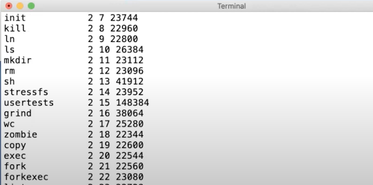

# 1.7 Shell

我说了很多XV6的长的很像Unix的Shell，相对图形化用户接口来说，这里的Shell通常也是人们说的命令行接口。如果你还没有用过Shell，Shell是一种对于Unix系统管理来说非常有用的接口，它提供了很多工具来管理文件，编写程序，编写脚本。你之前看过我演示一些Shell的功能，通常来说，当你输入内容时，你是在告诉Shell运行相应的程序。所以当我输入ls时，实际的意义是我要求Shell运行名为ls的程序，文件系统中会有一个文件名为ls，这个文件中包含了一些计算机指令，所以实际上，当我输入ls时，我是在要求Shell运行位于文件ls内的这些计算机指令。

我现在运行ls，它实际的工作就是输出当前目录的文件列表。

