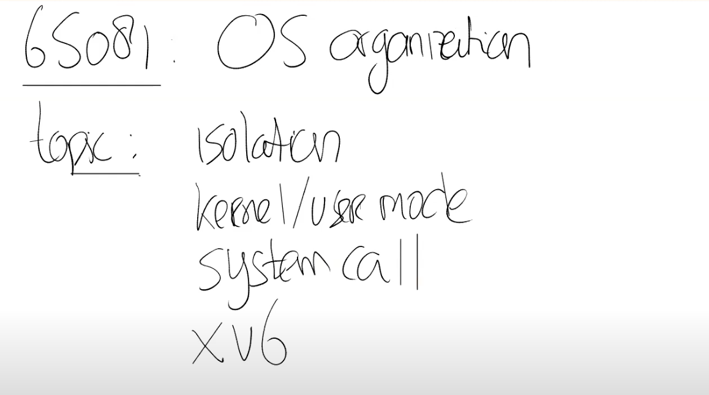

# 3.1 上一节课回顾

这节课的内容是操作系统的组织结构。今天我们主要讨论4个话题：

* Isolation。隔离性是设计操作系统组织结构的驱动力。
* Kernel和User mode。这两种模式用来隔离操作系统内核和用户应用程序。
* System calls。系统调用是你的应用程序能够转换到内核执行的基本方法，这样你的用户态应用程序才能使用内核服务。
* 最后我们会看到所有的这些是如何以一种简单的方式在XV6中实现。

