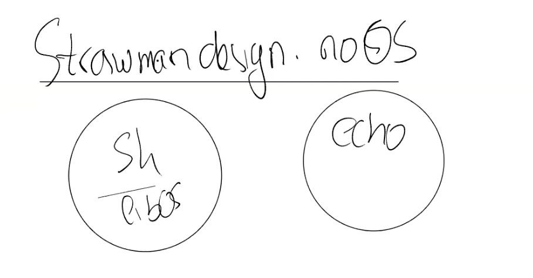
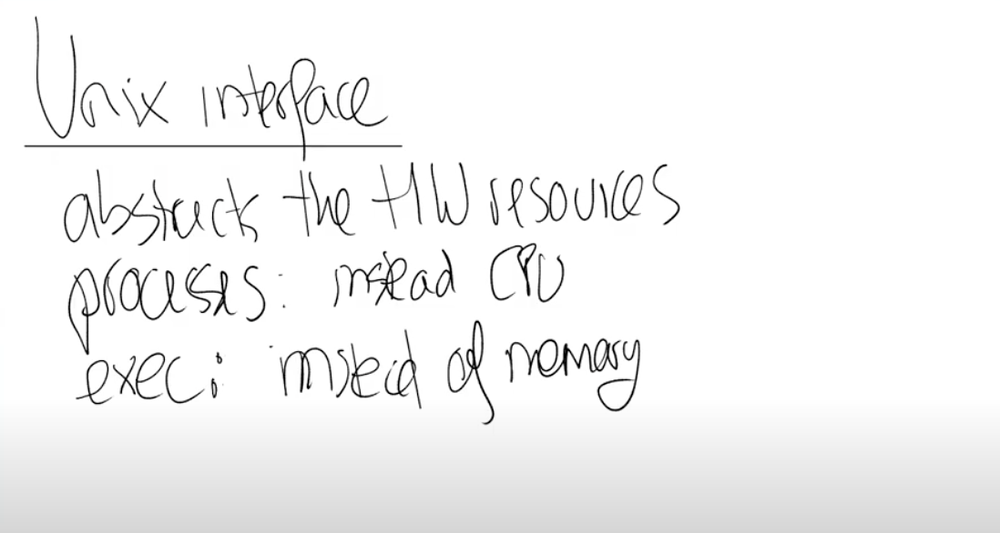

# 3.2 操作系统隔离性（isolation）

我们首先来简单的介绍一下隔离性（isolation），以及介绍为什么它很重要，为什么我们需要关心它？

这里的核心思想相对来说比较简单。我们在用户空间有多个应用程序，例如Shell，echo，find。但是，如果你通过Shell运行你们的Prime代码（lab1中的一个部分）时，假设你们的代码出现了问题，Shell不应该会影响到其他的应用程序。举个反例，如果Shell出现问题时，杀掉了其他的进程，这将会非常糟糕。所以你需要在不同的应用程序之间有强隔离性。

类似的，操作系统某种程度上为所有的应用程序服务。当你的应用程序出现问题时，你会希望操作系统不会因此而崩溃。比如说你向操作系统传递了一些奇怪的参数，你会希望操作系统仍然能够很好的处理它们（能较好的处理异常情况）。所以，你也需要在应用程序和操作系统之间有强隔离性。

这里我们可以这样想，如果没有操作系统会怎样？我们可以用稻草人提案法（就是通过头脑风暴找出缺点）来考虑一下，如果没有操作系统，或者操作系统只是一些库文件，比如说你在使用Python，通过import os你就可以将整个操作系统加载到你的应用程序中。那么现在，我们有一个Shell，并且我们引用了代表操作系统的库。同时，我们有一些其他的应用程序例如，echo。

 (1).png>)

我们可以认为exec抽象了内存。当我们在执行exec系统调用的时候，我们会传入一个文件名，而这个文件名对应了一个应用程序的内存镜像。内存镜像里面包括了程序对应的指令，全局的数据。应用程序可以逐渐扩展自己的内存，但是应用程序并没有直接访问物理内存的权限，例如应用程序不能直接访问物理内存的1000-2000这段地址。不能直接访问的原因是，操作系统会提供内存隔离并控制内存，操作系统会在应用程序和硬件资源之间提供一个中间层。exec是这样一种系统调用，它表明了应用程序不能直接访问物理内存。

