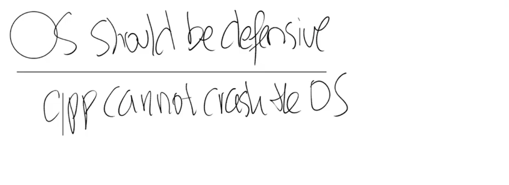

# 3.3 操作系统防御性（Defensive）

现在我们有一个操作系统，并且有一些应用程序正在运行。这里有一件事情需要考虑：操作系统应该具有防御性（Defensive）。

当你在做内核开发时，这是一种你需要熟悉的重要思想。操作系统需要确保所有的组件都能工作，所以它需要做好准备抵御来自应用程序的攻击。如果说应用程序无意或者恶意的向系统调用传入一些错误的参数就会导致操作系统崩溃，那就太糟糕了。在这种场景下，操作系统因为崩溃了会拒绝为其他所有的应用程序提供服务。所以操作系统需要以这样一种方式来完成：操作系统需要能够应对恶意的应用程序。

