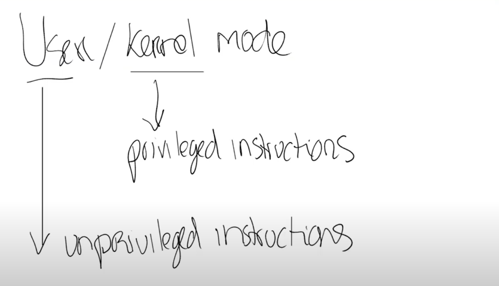

# 3.4 硬件对于强隔离的支持

硬件对于强隔离的支持包括了：user/kernle mode和虚拟内存。

首先，我们来看一下user/kernel mode，这里会以尽可能全局的视角来介绍，有很多重要的细节在这节课中都不会涉及。为了支持user/kernel mode，处理器会有两种操作模式，第一种是user mode，第二种是kernel mode。当运行在kernel mode时，CPU可以运行特定权限的指令（privileged instructions）；当运行在user mode时，CPU只能运行普通权限的指令（unprivileged instructions）。

。

> 学生提问：考虑到安全性，所有的用户代码都会通过内核访问硬件，但是有没有可能一个计算机的用户可以随意的操纵内核？
>
> Frans教授：并不会，至少小心的设计就不会发生这种事。或许一些程序会有额外的权限，操作系统也会认可这一点。但是这些额外的权限并不会给每一个用户，比如只有root用户有特定的权限来完成安全相关的操作。
>
> 同一个学生提问：那BIOS呢？BIOS会在操作系统之前运行还是之后？
>
> Frans教授：BIOS是一段计算机自带的代码，它会先启动，之后它会启动操作系统，所以BIOS需要是一段可被信任的代码，它最好是正确的，且不是恶意的。
>
> 学生提问：之前提到，设置处理器中kernel mode的bit位的指令是一条特殊权限指令，那么一个用户程序怎么才能让内核执行任何内核指令？因为现在切换到kernel mode的指令都是一条特殊权限指令了，对于用户程序来说也没法修改那个bit位。
>
> Frans教授：你说的对，这也是我们想要看到的结果。可以这么来看这个问题，首先这里不是完全按照你说的方式工作，在RISC-V中，如果你在用户空间（user space）尝试执行一条特殊权限指令（后面Frans那边的Zoom就断了，等他重新接入，他也没有再继续回答，所以后半段回答是我补充的）用户程序会通过系统调用来切换到kernel mode。当用户程序执行系统调用，会通过ECALL触发一个软中断（software interrupt），软中断会查询操作系统预先设定的中断向量表，并执行中断向量表中包含的中断处理程序。中断处理程序在内核中，这样就完成了user mode到kernel mode的切换，并执行用户程序想要执行的特殊权限指令。

我们接下来看看硬件对于支持强隔离性的第二个特性，基本上所有的CPU都支持虚拟内存。我下节课会更加深入的讨论虚拟内存，这里先简单看一下。基本上来说，处理器包含了page table，而page table将虚拟内存地址与物理内存地址做了对应。

