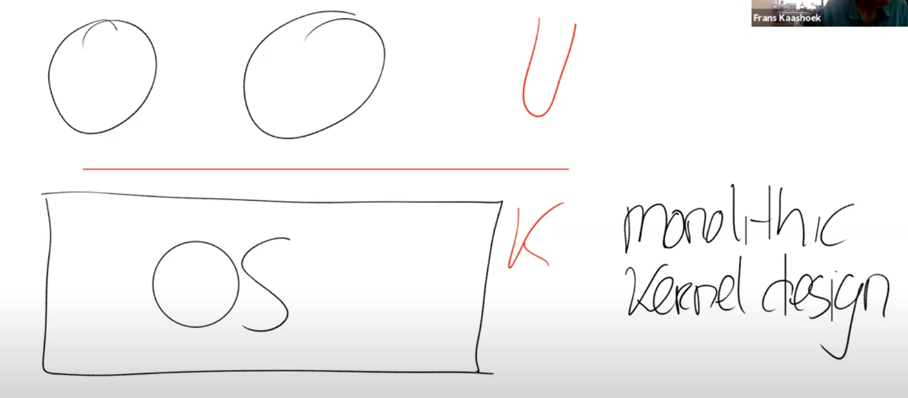
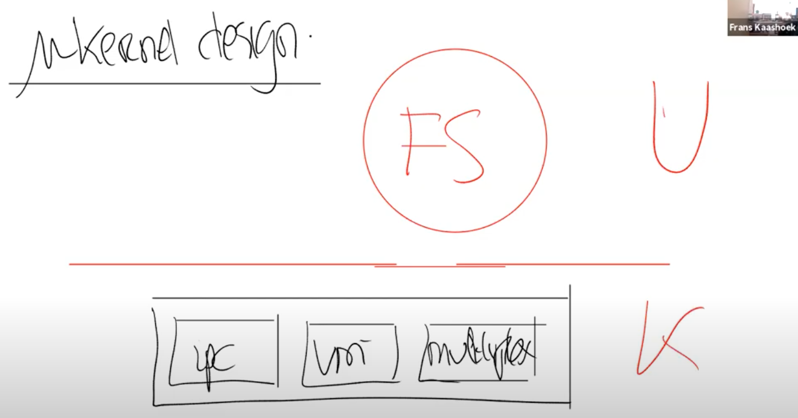

# 3.6 宏内核 vs 微内核 （Monolithic Kernel vs Micro Kernel）

现在，我们有了一种方法，可以通过系统调用或者说ECALL指令，将控制权从应用程序转到操作系统中。之后内核负责实现具体的功能并检查参数以确保不会被一些坏的参数所欺骗。所以内核有时候也被称为可被信任的计算空间（Trusted Computing Base），在一些安全的术语中也被称为TCB。

基本上来说，要被称为TCB，内核首先要是正确且没有Bug的。假设内核中有Bug，攻击者可能会利用那个Bug，并将这个Bug转变成漏洞，这个漏洞使得攻击者可以打破操作系统的隔离性并接管内核。所以内核真的是需要越少的Bug越好（但是谁不是呢）。

）。

）。在这种模式下，希望在kernel mode中运行尽可能少的代码。所以这种设计下还是有内核，但是内核只有非常少的几个模块，例如，内核通常会有一些IPC的实现或者是Message passing；非常少的虚拟内存的支持，可能只支持了page table；以及分时复用CPU的一些支持。

微内核的目的在于将大部分的操作系统运行在内核之外。所以，我们还是会有user mode以及user/kernel mode的边界。但是我们现在会将原来在内核中的其他部分，作为普通的用户程序来运行。比如文件系统可能就是个常规的用户空间程序。这个文件系统我不小心画成了红色，其实我想画成黑色的。

