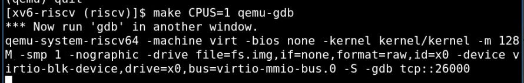
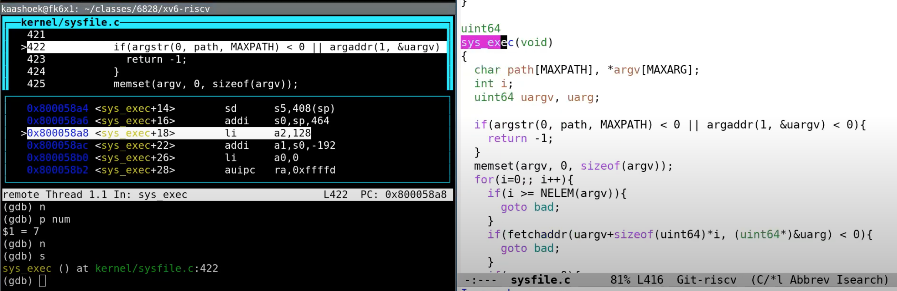

# 3.9 XV6 启动过程

接下来，我会系统的介绍XV6，让你们对XV6的结构有个大概的了解。在后面的课程，我们会涉及到更多的细节。

首先，我会启动QEMU，并打开gdb。本质上来说QEMU内部有一个gdb server，当我们启动之后，QEMU会等待gdb客户端连接。

_ 这一行是实际执行系统调用。这里可以看出，num用来索引一个数组，这个数组是一个函数指针数组，可以预期的是syscall\[7]对应了exec的入口函数。我们跳到这个函数中去，可以看到，我们现在在sys\_exec函数中。

