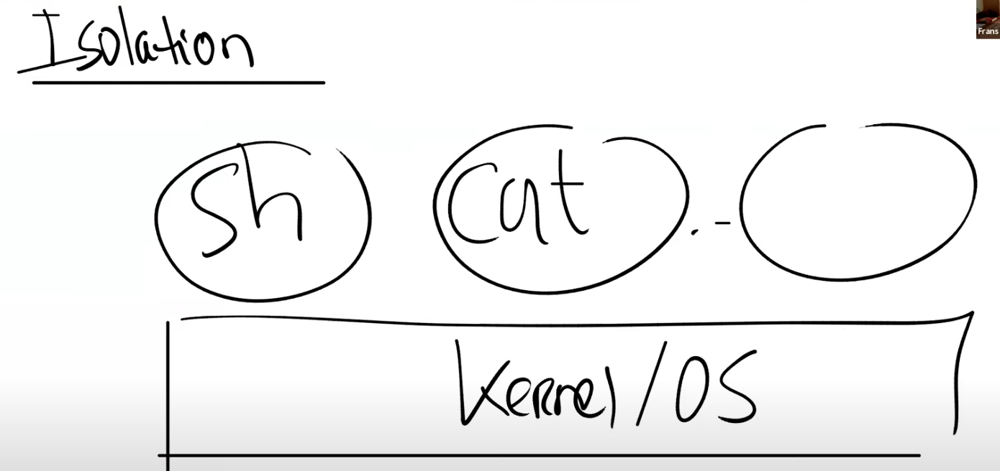

# 4.2 地址空间（Address Spaces）

在课程最开始的回答中，很多同学都提到了，创造虚拟内存的一个出发点是你可以通过它实现隔离性。如果你正确的设置了page table，并且通过代码对它进行正确的管理，那么原则上你可以实现强隔离。所以，我们先来回顾一下，我们期望从隔离性中得到什么样的效果。

在我们一个常出现的图中，我们有一些用户应用程序比如说Shell，cat以及你们自己在lab1创造的各种工具。在这些应用程序下面，我们有操作系统位于内核空间。

_，这里等效于将7写入内存地址1000。

