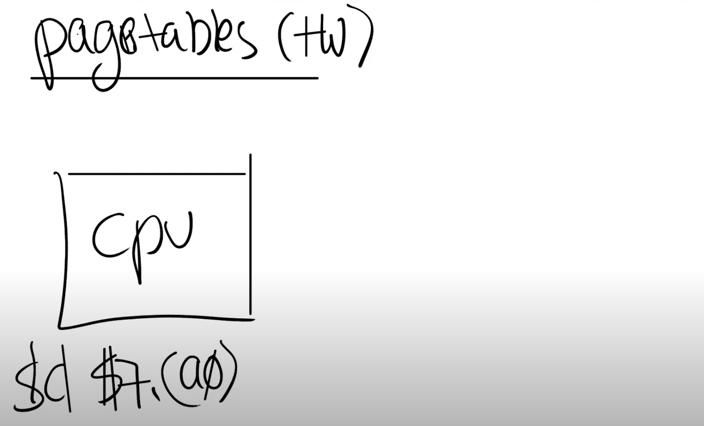
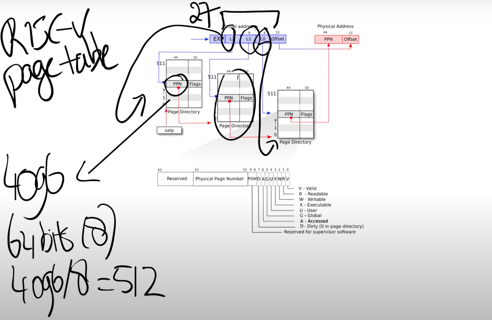

# 4.3 页表（Page Table）

我们如何能够实现地址空间呢？或者说如何在一个物理内存上，创建不同的地址空间？

最常见的方法，同时也是非常灵活的一种方法就是使用页表（Page Tables）。页表是在硬件中通过处理器和内存管理单元（Memory Management Unit）实现。所以，在你们的脑海中，应该有这么一张图：CPU正在执行指令，例如_sd $7, (a0)。_

，这样我们就能得到一个PPN，也就是物理page号。这个PPN指向了中间级的page directory。

当我们在使用中间级的page directory时，我们通过虚拟内存地址中的L1部分完成索引。接下来会走到最低级的page directory，我们通过虚拟内存地址中的L0部分完成索引。在最低级的page directory中，我们可以得到对应于虚拟内存地址的物理内存地址。

