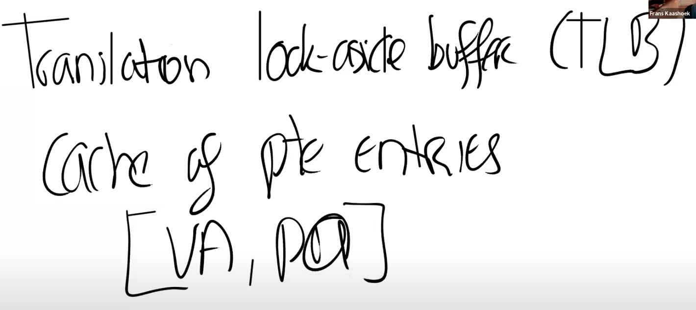
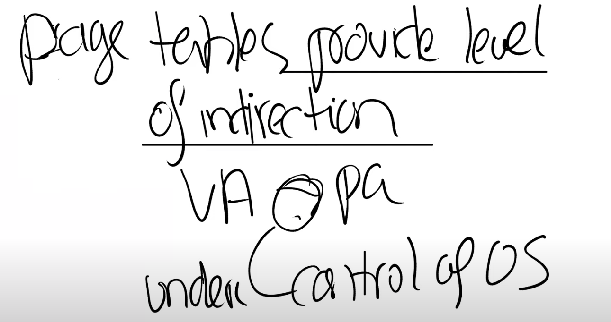

# 4.4 页表缓存（Translation Lookaside Buffer）

如果我们回想一下page table的结构，你可以发现，当处理器从内存加载或者存储数据时，基本上都要做3次内存查找，第一次在最高级的page directory，第二次在中间级的page directory，最后一次在最低级的page directory。所以对于一个虚拟内存地址的寻址，需要读三次内存，这里代价有点高。所以实际中，几乎所有的处理器都会对于最近使用过的虚拟地址的翻译结果有缓存。这个缓存被称为：Translation Lookside Buffer（通常翻译成页表缓存）。你会经常看到它的缩写TLB。基本上来说，这就是Page Table Entry的缓存，也就是PTE的缓存。

当处理器第一次查找一个虚拟地址时，硬件通过3级page table得到最终的PPN，TLB会保存虚拟地址到物理地址的映射关系。这样下一次当你访问同一个虚拟地址时，处理器可以查看TLB，TLB会直接返回物理地址，而不需要通过page table得到结果。

）。我这里说的抽象就是指从虚拟地址到物理地址的映射。这里的映射关系完全由操作系统控制。

