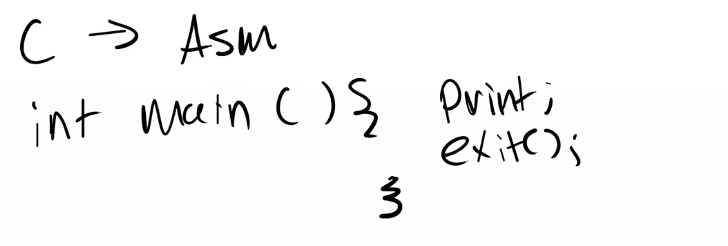

# 5.1 C程序到汇编程序的转换

（00:00 - 05:25 在讨论syscall lab，没有什么实质内容故跳过）

今天的课程，我们会稍微讨论C语言转换到汇编语言的过程，以及处理器相关的内容。今天的课程更多偏向的是实际应用，或者至少我们的目标是这样。所以这节课的目标是让你们熟悉RISC-V处理器，汇编语言，以及RISC-V的calling convention。对于page table来说这些内容不太重要，但是对于这周要发布的traps lab来说，这些内容至关重要，因为在这个实验中你们将会频繁用到trapframe（注，XV6中用来实现trap的一个内存page，lecture 6有详细内容）和栈。这些就是今天这节课的主要内容。

我们首先来简单看一下C语言是如何转换成汇编语言的。这部分内容有点像是对你们之前学过的6.004或者任意其他计算机架构课程的简单回顾。

通常来说，我们的C语言程序会有一个main函数，假设在这个函数内你执行了一些打印然后退出了。

