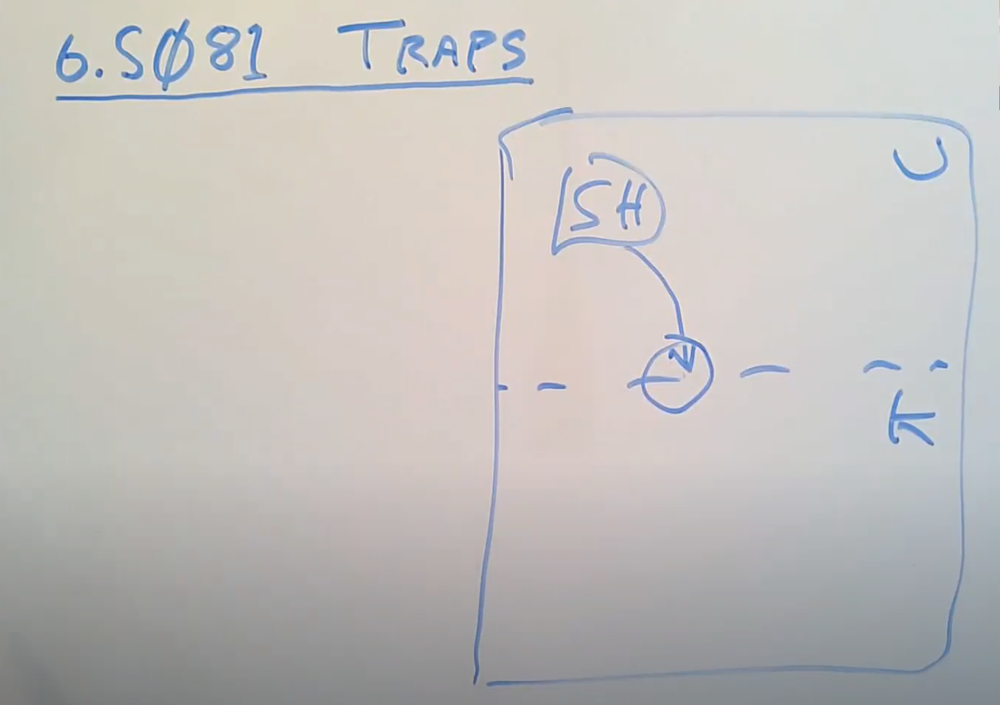

# 6.1 Trap机制

今天我想讨论一下，程序运行是完成用户空间和内核空间的切换。每当

* 程序执行系统调用
* 程序出现了类似page fault、运算时除以0的错误
* 一个设备触发了中断使得当前程序运行需要响应内核设备驱动

都会发生这样的切换 。

这里用户空间和内核空间的切换通常被称为trap，而trap涉及了许多小心的设计和重要的细节，这些细节对于实现安全隔离和性能来说非常重要。因为很多应用程序，要么因为系统调用，要么因为page fault，都会频繁的切换到内核中。所以，trap机制要尽可能的简单，这一点非常重要。

初始的场景你们已经非常熟悉了。我们有一些用户应用程序，例如Shell，它运行在用户空间，同时我们还有内核空间。Shell可能会执行系统调用，将程序运行切换到内核。比如XV6启动之后Shell输出的一些提示信息，就是通过执行write系统调用来输出的。这是Shell尝试执行wrtie系统调用的一个例子。

