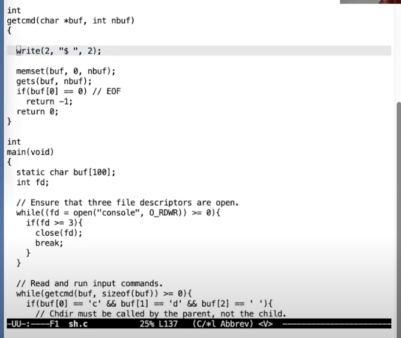
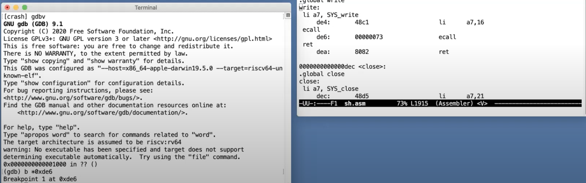

# 6.3 ECALL指令之前的状态

接下来，我将切换到gdb的世界中。 大家可以看我共享的屏幕，我们将要跟踪一个XV6的系统调用，也就是Shell将它的提示信息通过write系统调用走到操作系统再输出到console的过程。你们可以看到，用户代码sh.c初始了这一切。

 (1) (1).png>)

上面这几行代码就是实际被调用的write函数的实现。这是个非常短的函数，它首先将SYS\_write加载到a7寄存器，SYS\_write是常量16。这里告诉内核，我想要运行第16个系统调用，而这个系统调用正好是write。之后这个函数中执行了ecall指令，从这里开始代码执行跳转到了内核。内核完成它的工作之后，代码执行会返回到用户空间，继续执行ecall之后的指令，也就是ret，最终返回到Shell中。所以ret从write库函数返回到了Shell中。

为了展示这里的系统调用，我会在ecall指令处放置一个断点，为了能放置断点，我们需要知道ecall指令的地址，我们可以通过查看由XV6编译过程产生的sh.asm找出这个地址。sh.asm是带有指令地址的汇编代码（注，asm文件3.7有介绍）。我这里会在ecall指令处放置一个断点，这条指令的地址是0xde6。

