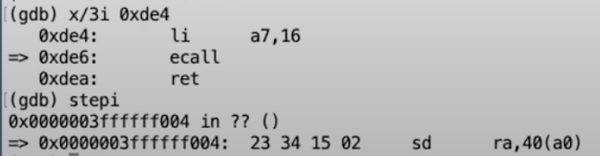
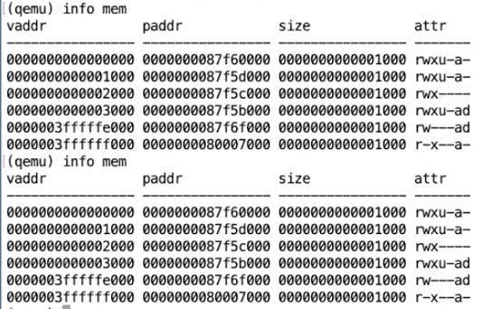

# 6.4 ECALL指令之后的状态

现在我执行ecall指令，

 (1) (1) (1) (1).png>)

可以看到程序计数器的值变化了，之前我们的程序计数器还在一个很小的地址0xde6，但是现在在一个大得多的地址。

我们还可以查看page table，我通过在QEMU中执行info mem来查看当前的page table，可以看出，这还是与之前完全相同的page table，所以page table没有改变。

 (1).png>)

尽管其他的寄存器还是还是用户寄存器，但是这里的程序计数器明显已经不是用户代码的程序计数器。这里的程序计数器是从STVEC寄存器拷贝过来的值。我们也可以打印SEPC（Supervisor Exception Program Counter）寄存器，这是ecall保存用户程序计数器的地方。

