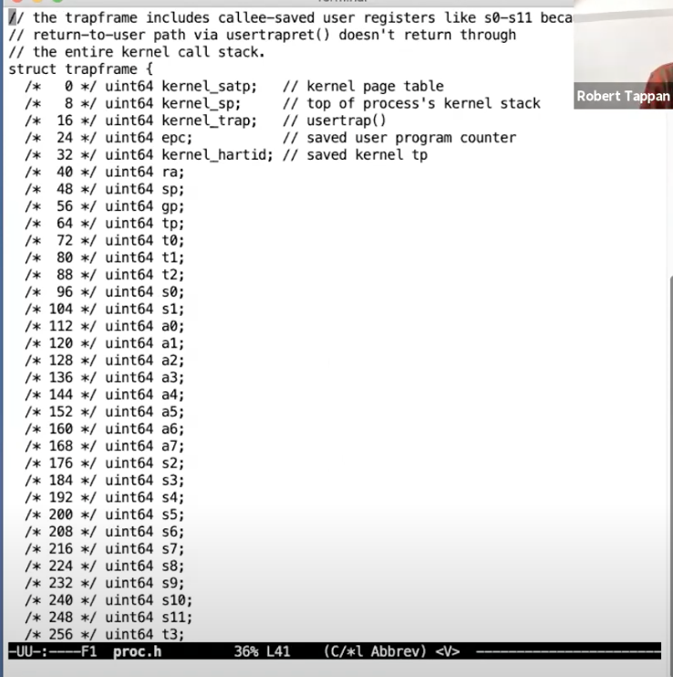

# 6.5 uservec函数

回到XV6和RISC-V，现在程序位于trampoline page的起始，也是uservec函数的起始。我们现在需要做的第一件事情就是保存寄存器的内容。在RISC-V上，如果不能使用寄存器，基本上不能做任何事情。所以，对于保存这些寄存器，我们有什么样的选择呢？

在一些其他的机器中，我们或许直接就将32个寄存器中的内容写到物理内存中某些合适的位置。但是我们不能在RISC-V中这样做，因为在RISC-V中，supervisor mode下的代码不允许直接访问物理内存。所以我们只能使用page table中的内容，但是从前面的输出来看，page table中也没有多少内容。

虽然XV6并没有使用，但是另一种可能的操作是，直接将SATP寄存器指向kernel page table，之后我们就可以直接使用所有的kernel mapping来帮助我们存储用户寄存器。这是合法的，因为supervisor mode可以更改SATP寄存器。但是在trap代码当前的位置，也就是trap机制的最开始，我们并不知道kernel page table的地址。并且更改SATP寄存器的指令，要求写入SATP寄存器的内容来自于另一个寄存器。所以，为了能执行更新page table的指令，我们需要一些空闲的寄存器，这样我们才能先将page table的地址存在这些寄存器中，然后再执行修改SATP寄存器的指令。

对于保存用户寄存器，XV6在RISC-V上的实现包括了两个部分。第一个部分是，XV6在每个user page table映射了trapframe page，这样每个进程都有自己的trapframe page。这个page包含了很多有趣的数据，但是现在最重要的数据是用来保存用户寄存器的32个空槽位。所以，在trap处理代码中，现在的好消息是，我们在user page table有一个之前由kernel设置好的映射关系，这个映射关系指向了一个可以用来存放这个进程的用户寄存器的内存位置。这个位置的虚拟地址总是0x3ffffffe000。

如果你想查看XV6在trapframe page中存放了什么，这部分代码在proc.h中的trapframe结构体中。

