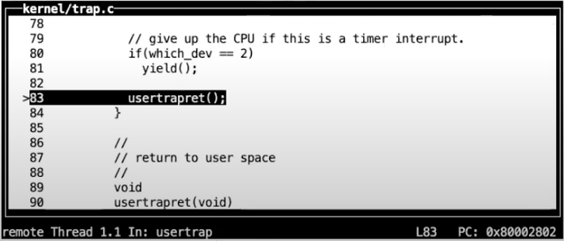
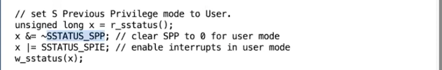

# 6.7 usertrapret函数

a0_ 指令）
* 从tp寄存器中读取当前的CPU核编号，并存储在trapframe中，这样trampoline代码才能恢复这个数字，因为用户代码可能会修改这个数字

现在我们在usertrapret函数中，我们正在设置trapframe中的数据，这样下一次从用户空间转换到内核空间时可以用到这些数据。

> 学生提问：为什么trampoline代码中不保存SEPC寄存器？
>
> Robert教授：可以存储。trampoline代码没有像其他寄存器一样保存这个寄存器，但是我们非常欢迎大家修改XV6来保存它。如果你还记得的话（详见6.6），这个寄存器实际上是在C代码usertrap中保存的，而不是在汇编代码trampoline中保存的。我想不出理由这里哪种方式更好。用户寄存器（User Registers）必须在汇编代码中保存，因为任何需要经过编译器的语言，例如C语言，都不能修改任何用户寄存器。所以对于用户寄存器，必须要在进入C代码之前在汇编代码中保存好。但是对于SEPC寄存器（注，控制寄存器），我们可以早点保存或者晚点保存。

