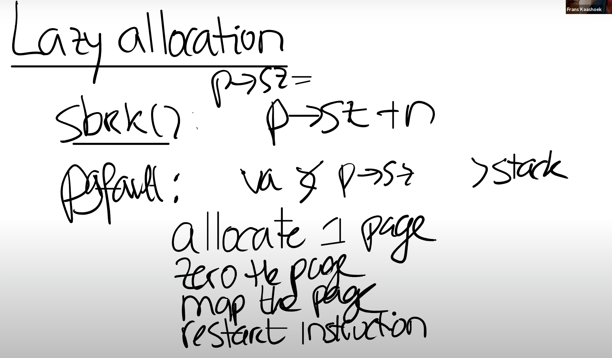

# 8.2 Lazy page allocation

我们首先来看一下内存allocation，或者更具体的说sbrk。sbrk是XV6提供的系统调用，它使得用户应用程序能扩大自己的heap。当一个应用程序启动的时候，sbrk指向的是heap的最底端，同时也是stack的最顶端。这个位置通过代表进程的数据结构中的sz字段表示，这里以_p->sz表示_。

 (2).png>)

当调用sbrk时，它的参数是整数，代表了你想要申请的page数量（注，原视频说的是page，但是根据Linux [man page](https://man7.org/linux/man-pages/man2/sbrk.2.html)，实际中sbrk的参数是字节数）。sbrk会扩展heap的上边界（也就是会扩大heap）。

 (1).png>)

这意味着，当sbrk实际发生或者被调用的时候，内核会分配一些物理内存，并将这些内存映射到用户应用程序的地址空间，然后将内存内容初始化为0，再返回sbrk系统调用。这样，应用程序可以通过多次sbrk系统调用来增加它所需要的内存。类似的，应用程序还可以通过给sbrk传入负数作为参数，来减少或者压缩它的地址空间。不过在这节课我们只关注增加内存的场景。

在XV6中，sbrk的实现默认是eager allocation。这表示了，一旦调用了sbrk，内核会立即分配应用程序所需要的物理内存。但是实际上，对于应用程序来说很难预测自己需要多少内存，所以通常来说，应用程序倾向于申请多于自己所需要的内存。这意味着，进程的内存消耗会增加许多，但是有部分内存永远也不会被应用程序所使用到。

你或许会认为这里很蠢，怎么可以这样呢？你可以设想自己写了一个应用程序，读取了一些输入然后通过一个矩阵进行一些运算。你需要为最坏的情况做准备，比如说为最大可能的矩阵分配内存，但是应用程序可能永远也用不上这些内存，通常情况下，应用程序会在一个小得多的矩阵上进行运算。所以，程序员过多的申请内存但是过少的使用内存，这种情况还挺常见的。

原则上来说，这不是一个大问题。但是使用虚拟内存和page fault handler，我们完全可以用某种更聪明的方法来解决这里的问题，这里就是利用lazy allocation。核心思想非常简单，sbrk系统调基本上不做任何事情，唯一需要做的事情就是提升_p->sz_，将_p->sz_增加n，其中n是需要新分配的内存page数量。但是内核在这个时间点并不会分配任何物理内存。之后在某个时间点，应用程序使用到了新申请的那部分内存，这时会触发page fault，因为我们还没有将新的内存映射到page table。所以，如果我们解析一个大于旧的_p->sz_，但是又小于新的_p->sz（注，也就是旧的p->sz + n）_的虚拟地址，我们希望内核能够分配一个内存page，并且重新执行指令。

所以，当我们看到了一个page fault，相应的虚拟地址小于当前_p->sz_，同时大于stack，那么我们就知道这是一个来自于heap的地址，但是内核还没有分配任何物理内存。所以对于这个page fault的响应也理所当然的直接明了：在page fault handler中，通过kalloc函数分配一个内存page；初始化这个page内容为0；将这个内存page映射到user page table中；最后重新执行指令。比方说，如果是load指令，或者store指令要访问属于当前进程但是还未被分配的内存，在我们映射完新申请的物理内存page之后，重新执行指令应该就能通过了。

