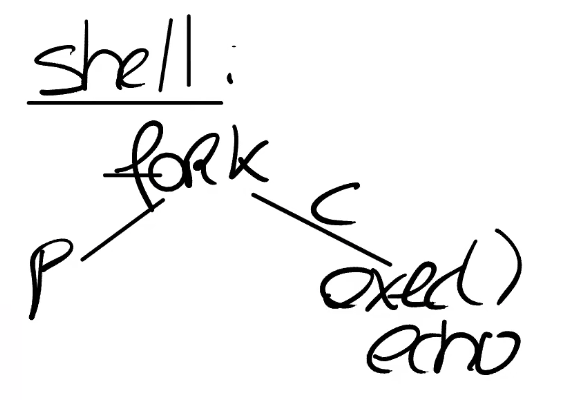

# 8.4 Copy On Write Fork

下一个是一个非常常见的优化，许多操作系统都实现了它，同时它也是后面一个实验的内容。这就是copy-on-write fork，有时也称为COW fork。

当Shell处理指令时，它会通过fork创建一个子进程。fork会创建一个Shell进程的拷贝，所以这时我们有一个父进程（原来的Shell）和一个子进程。Shell的子进程执行的第一件事情就是调用exec运行一些其他程序，比如运行echo。现在的情况是，fork创建了Shell地址空间的一个完整的拷贝，而exec做的第一件事情就是丢弃这个地址空间，取而代之的是一个包含了echo的地址空间。这里看起来有点浪费。

