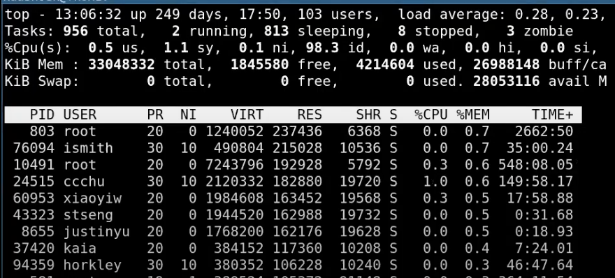

# 9.1 真实操作系统内存使用情况

（00:00 - 03:32 在对前两个lab提问，与内容无关故跳过）

今天课程的内容是中断。但是在具体介绍中断之前，我想先回顾一下上周一些有趣的内容。因为上周的课程主要是讲内存，我们收到了很多内存相关的问题。我想先讨论一下内存是如何被真实的操作系统（而不是像XV6这样的教学操作系统）所使用。

下图是一台Athena计算机（注，MIT内部共享使用的计算机）的top指令输出。如果你查看Mem这一行，

