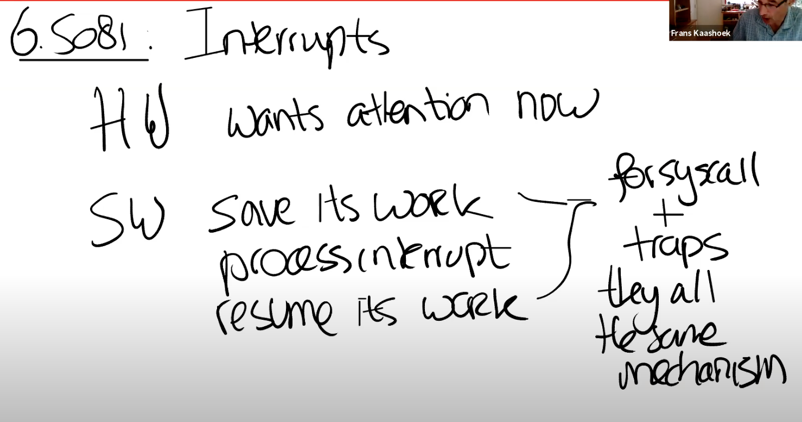

# 9.2 Interrupt硬件部分

今天课程的主要内容是中断。中断对应的场景很简单，就是硬件想要得到操作系统的关注。例如网卡收到了一个packet，网卡会生成一个中断；用户通过键盘按下了一个按键，键盘会产生一个中断。操作系统需要做的是，保存当前的工作，处理中断，处理完成之后再恢复之前的工作。这里的保存和恢复工作，与我们之前看到的系统调用过程（注，详见lec06）非常相似。所以系统调用，page fault，中断，都使用相同的机制。

