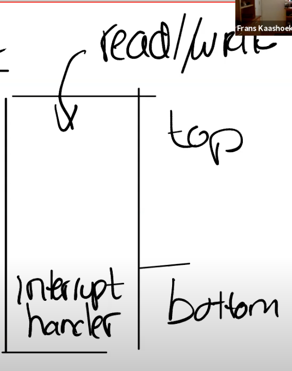

# 9.3 设备驱动概述

通常来说，管理设备的代码称为驱动，所有的驱动都在内核中。我们今天要看的是UART设备的驱动，代码在uart.c文件中。如果我们查看代码的结构，我们可以发现大部分驱动都分为两个部分，bottom/top。

bottom部分通常是Interrupt handler。当一个中断送到了CPU，并且CPU设置接收这个中断，CPU会调用相应的Interrupt handler。Interrupt handler并不运行在任何特定进程的context中，它只是处理中断。

top部分，是用户进程，或者内核的其他部分调用的接口。对于UART来说，这里有read/write接口，这些接口可以被更高层级的代码调用。

