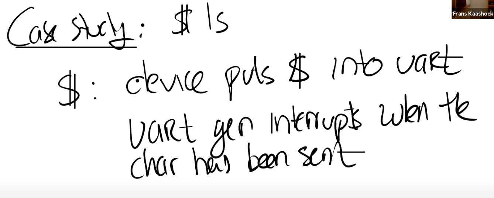

# 9.4 在XV6中设置中断

当XV6启动时，Shell会输出提示符“$ ”，如果我们在键盘上输入ls，最终可以看到“$ ls”。我们接下来通过研究Console是如何显示出“$ ls”，来看一下设备中断是如何工作的。

实际上“$ ”和“ls”还不太一样，“$ ”是Shell程序的输出，而“ls”是用户通过键盘输入之后再显示出来的。

对于“$ ”来说，实际上就是设备会将字符传输给UART的寄存器，UART之后会在发送完字符之后产生一个中断。在QEMU中，模拟的线路的另一端会有另一个UART芯片（模拟的），这个UART芯片连接到了虚拟的Console，它会进一步将“$ ”显示在console上。

