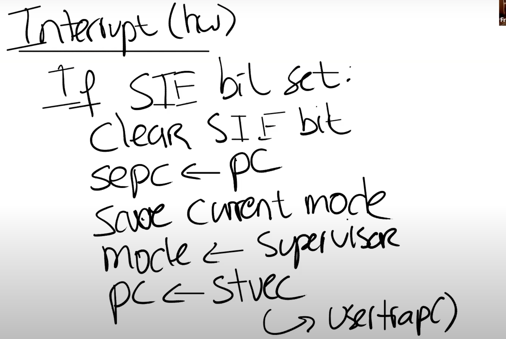
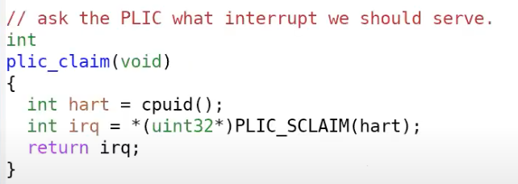

# 9.6 UART驱动的bottom部分

在我们向Console输出字符时，如果发生了中断，RISC-V会做什么操作？我们之前已经在SSTATUS寄存器中打开了中断，所以处理器会被中断。假设键盘生成了一个中断并且发向了PLIC，PLIC会将中断路由给一个特定的CPU核，并且如果这个CPU核设置了SIE寄存器的E bit（注，针对外部中断的bit位），那么会发生以下事情：

* 首先，会清除SIE寄存器相应的bit，这样可以阻止CPU核被其他中断打扰，该CPU核可以专心处理当前中断。处理完成之后，可以再次恢复SIE寄存器相应的bit。
* 之后，会设置SEPC寄存器为当前的程序计数器。我们假设Shell正在用户空间运行，突然来了一个中断，那么当前Shell的程序计数器会被保存。
* 之后，要保存当前的mode。在我们的例子里面，因为当前运行的是Shell程序，所以会记录user mode。
* 再将mode设置为Supervisor mode。
* 最后将程序计数器的值设置成STVEC的值。（注，STVEC用来保存trap处理程序的地址，详见lec06）在XV6中，STVEC保存的要么是uservec或者kernelvec函数的地址，具体取决于发生中断时程序运行是在用户空间还是内核空间。在我们的例子中，Shell运行在用户空间，所以STVEC保存的是uservec函数的地址。而从之前的课程我们可以知道uservec函数会调用usertrap函数。所以最终，我们在usertrap函数中。我们这节课不会介绍trap过程中的拷贝，恢复过程，因为在之前的课程中已经详细的介绍过了。

 (1) (1) (1) (1).png>)

plic\_claim函数位于plic.c文件中。在这个函数中，当前CPU核会告知PLIC，自己要处理中断，PLIC\_SCLAIM会将中断号返回，对于UART来说，返回的中断号是10。

