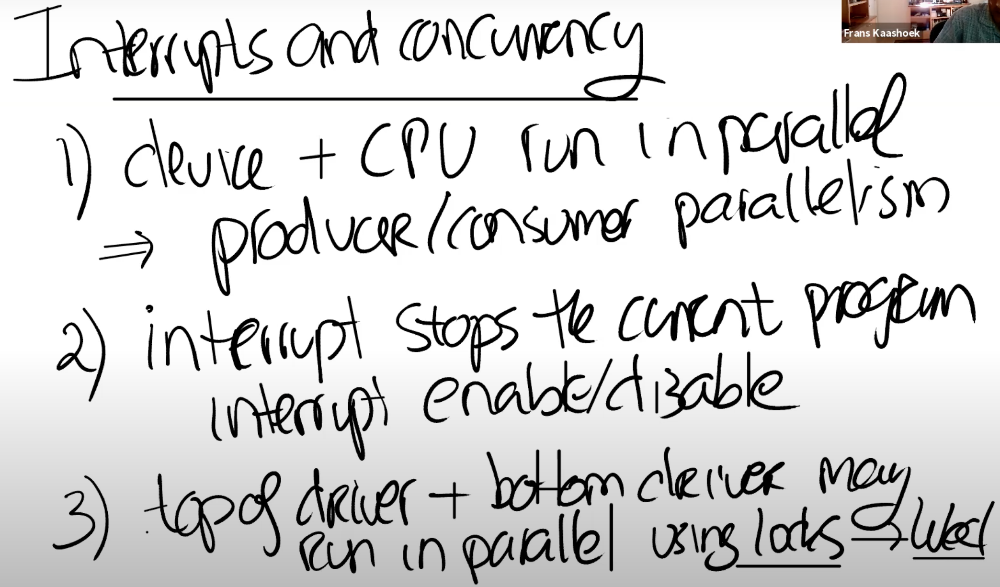

# 9.7 Interrupt相关的并发

接下来我们讨论一下与中断相关的并发，并发加大了中断编程的难度。这里的并发包括以下几个方面：

* 设备与CPU是并行运行的。例如当UART向Console发送字符的时候，CPU会返回执行Shell，而Shell可能会再执行一次系统调用，向buffer中写入另一个字符，这些都是在并行的执行。这里的并行称为producer-consumer并行。
* 中断会停止当前运行的程序。例如，Shell正在运行第212个指令，突然来了个中断，Shell的执行会立即停止。对于用户空间代码，这并不是一个大的问题，因为当我们从中断中返回时，我们会恢复用户空间代码，并继续执行执行停止的指令。我们已经在trap和page fault中看过了这部分内容。但是当内核被中断打断时，事情就不一样了。所以，代码运行在kernel mode也会被中断，这意味着即使是内核代码，也不是直接串行运行的。在两个内核指令之间，取决于中断是否打开，可能会被中断打断执行。对于一些代码来说，如果不能在执行期间被中断，这时内核需要临时关闭中断，来确保这段代码的原子性。
* 驱动的top和bottom部分是并行运行的。例如，Shell会在传输完提示符“$”之后再调用write系统调用传输空格字符，代码会走到UART驱动的top部分（注，uartputc函数），将空格写入到buffer中。但是同时在另一个CPU核，可能会收到来自于UART的中断，进而执行UART驱动的bottom部分，查看相同的buffer。所以一个驱动的top和bottom部分可以并行的在不同的CPU上运行。这里我们通过lock来管理并行。因为这里有共享的数据，我们想要buffer在一个时间只被一个CPU核所操作。&#x20;

