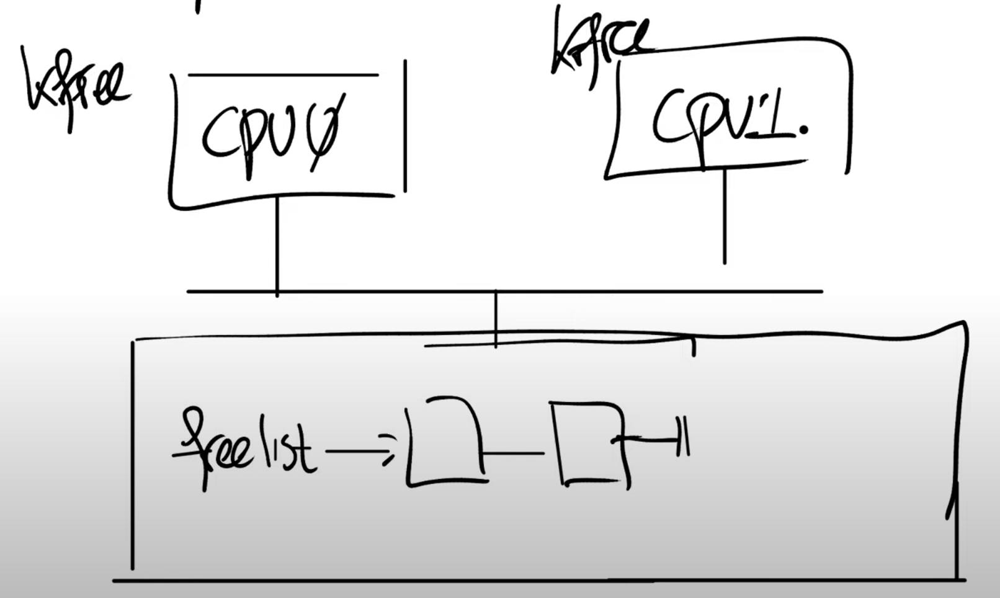
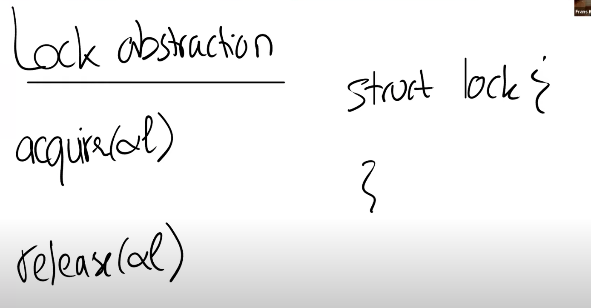

# 10.2 锁如何避免race condition？

首先你们在脑海里应该有多个CPU核在运行，比如说CPU0在运行指令，CPU1也在运行指令，这两个CPU核都连接到同一个内存上。在前面的代码中，数据freelist位于内存中，它里面记录了2个内存page。假设两个CPU核在相同的时间调用kfree。

 (2) (2) (2) (2).png>)

接下来，剩下的代码也会并行的执行（kmem.freelist = r），这行代码会更新freelist为r。因为我们这里只有一个内存，所以总是有一个CPU会先执行，另一个后执行。我们假设CPU0先执行，那么freelist会等于CPU0的变量r。之后CPU1再执行，它又会将freelist更新为CPU1的变量r。这样的结果是，我们丢失了CPU0对应的page。CPU0想要释放的内存page最终没有出现在freelist数据中。

这是一种具体的坏的结果，当然可能会有更多坏的结果，因为可能会有更多的CPU。例如第三个CPU可能会短暂的发现freelist等于CPU0对应的变量r，并且使用这个page，但是之后很快freelist又被CPU1更新了。所以，拥有越多的CPU，我们就可能看到比丢失page更奇怪的现象。

在代码中，用来解决这里的问题的最常见方法就是使用锁。

接下来让我具体的介绍一下锁。锁就是一个对象，就像其他在内核中的对象一样。有一个结构体叫做lock，它包含了一些字段，这些字段中维护了锁的状态。锁有非常直观的API：

* acquire，接收指向lock的指针作为参数。acquire确保了在任何时间，只会有一个进程能够成功的获取锁。
* release，也接收指向lock的指针作为参数。在同一时间尝试获取锁的其他进程需要等待，直到持有锁的进程对锁调用release。

