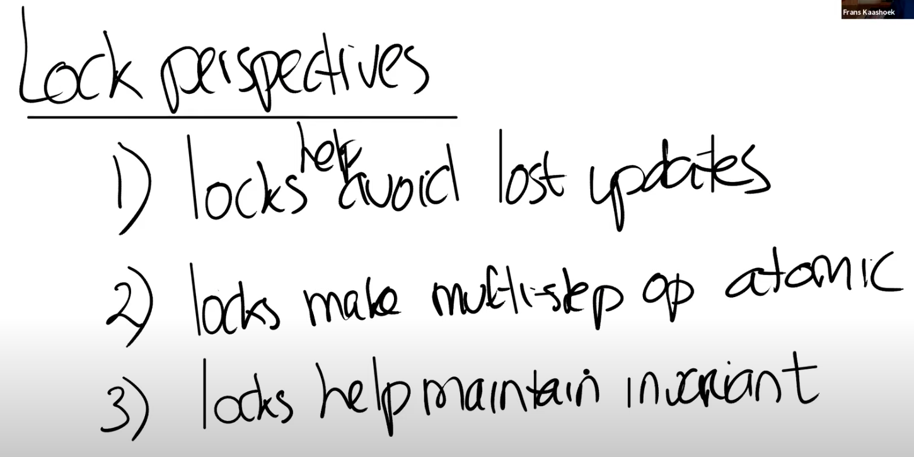

# 10.4 锁的特性和死锁

通常锁有三种作用，理解它们可以帮助你更好的理解锁。

* 锁可以避免丢失更新。如果你回想我们之前在kalloc.c中的例子，丢失更新是指我们丢失了对于某个内存page在kfree函数中的更新。如果没有锁，在出现race condition的时候，内存page不会被加到freelist中。但是加上锁之后，我们就不会丢失这里的更新。
* 锁可以打包多个操作，使它们具有原子性。我们之前介绍了加锁解锁之间的区域是critical section，在critical section的所有操作会都会作为一个原子操作执行。
* 锁可以维护共享数据结构的不变性。共享数据结构如果不被任何进程修改的话是会保持不变的。如果某个进程acquire了锁并且做了一些更新操作，共享数据的不变性暂时会被破坏，但是在release锁之后，数据的不变性又恢复了。你们可以回想一下之前在kfree函数中的freelist数据，所有的free page都在一个单链表上。但是在kfree函数中，这个单链表的head节点会更新。freelist并不太复杂，对于一些更复杂的数据结构可能会更好的帮助你理解锁的作用。

