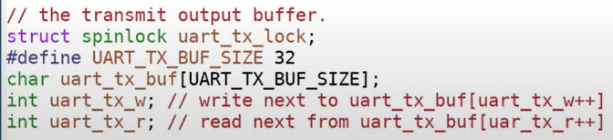
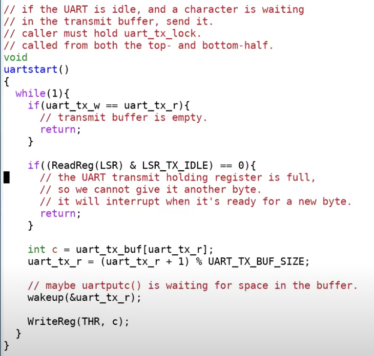

# 10.6 XV6中UART模块对于锁的使用

接下来我们看一下XV6的代码，通过代码来理解锁是如何在XV6中工作的。我们首先查看一下uart.c，在上节课介绍中断的时候我们提到了这里的锁，现在我们具体的来看一下。因为现在我们对锁更加的了解了，接下来将展示一些更有趣的细节。

从代码上看UART只有一个锁。

 (1) (1).png>)

函数首先获得了锁，然后查看当前缓存是否还有空槽位，如果有的话将数据放置于空槽位中；写指针加1；调用uartstart；最后释放锁。

如果两个进程在同一个时间调用uartputc，那么这里的锁会确保来自于第一个进程的一个字符进入到缓存的第一个槽位，接下来第二个进程的一个字符进入到缓存的第二个槽位。这就是锁帮助我们避免race condition的一个简单例子。如果没有锁的话，第二个进程可能会覆盖第一个进程的字符。

接下来我们看一下uartstart函数，

