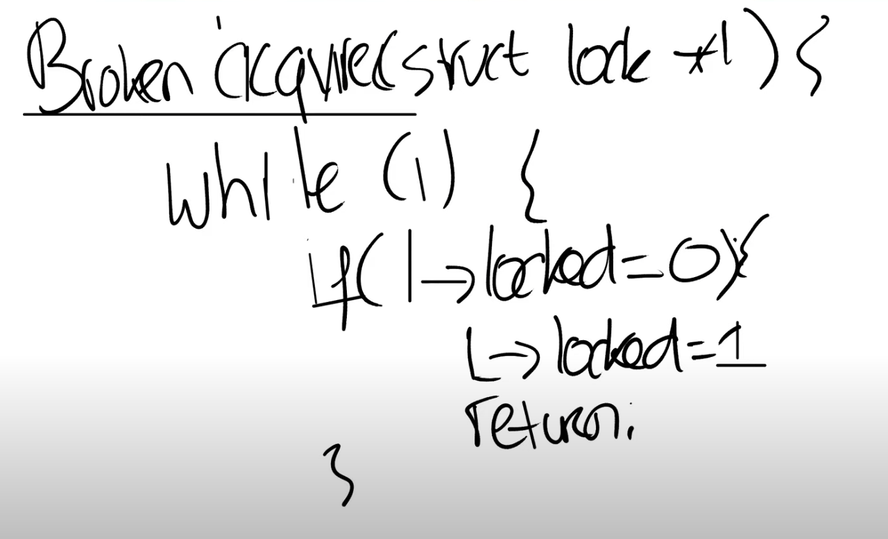

# 10.7 自旋锁（Spin lock）的实现（一）

接下来我们看一下如何实现自旋锁。锁的特性就是只有一个进程可以获取锁，在任何时间点都不能有超过一个锁的持有者。我们接下来看一下锁是如何确保这里的特性。

我们先来看一个有问题的锁的实现，这样我们才能更好的理解这里的挑战是什么。实现锁的主要难点在于锁的acquire接口，在acquire里面有一个死循环，循环中判断锁对象的locked字段是否为0，如果为0那表明当前锁没有持有者，当前对于acquire的调用可以获取锁。之后我们通过设置锁对象的locked字段为1来获取锁。最后返回。

 (1) (1) (1) (1).png>)
