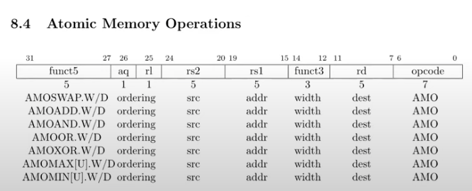

# 10.8 自旋锁（Spin lock）的实现（二）

有关spin lock的实现，有3个细节我想介绍一下。

首先，有很多同学提问说为什么release函数中不直接使用一个store指令将锁的locked字段写为0？有人想回答一下为什么吗？

> 学生回答：因为其他的处理器可能会向locked字段写入1，或者写入0。。。

是的，可能有两个处理器或者两个CPU同时在向locked字段写入数据。这里的问题是，对于很多人包括我自己来说，经常会认为一个store指令是一个原子操作，但实际并不总是这样，这取决于具体的实现。例如，对于CPU内的缓存，每一个cache line的大小可能大于一个整数，那么store指令实际的过程将会是：首先会加载cache line，之后再更新cache line。所以对于store指令来说，里面包含了两个微指令。这样的话就有可能得到错误的结果。所以为了避免理解硬件实现的所有细节，例如整数操作不是原子的，或者向一个64bit的内存值写数据是不是原子的，我们直接使用一个RISC-V提供的确保原子性的指令来将locked字段写为0。

amoswap并不是唯一的原子指令，下图是RISC-V的手册，它列出了所有的原子指令。

 (1).png>)

这样前面的例子中，x<-x+1就不会被移到特定的memory synchronization点之外。我们也就不会有memory ordering带来的问题。这就是为什么在acquire和release中都有\_\_sync\_synchronize函数的调用。

> 学生提问：有没有可能在锁acquire之前的一条指令被移到锁release之后？或者说这里会有一个界限不允许这么做？
>
> Frans教授：在这里的例子中，acquire和release都有自己的界限（注，也就是\_\_sync\_synchronize函数的调用点）。所以发生在锁acquire之前的指令不会被移到acquire的\_\_sync\_synchronize函数调用之后，这是一个界限。在锁的release函数中有另一个界限。所以在第一个界限之前的指令会一直在这个界限之前，在两个界限之间的指令会保持在两个界限之间，在第二个界限之后的指令会保持在第二个界限之后。

最后我们时间快到了，让我来总结一下这节课的内容。

首先，锁确保了正确性，但是同时又会降低性能，这是个令人失望的现实，我们是因为并发运行代码才需要使用锁，而锁另一方面又限制了代码的并发运行。

其次锁会增加编写程序的复杂性，在我们的一些实验中会看到锁，我们需要思考锁为什么在这，它需要保护什么。如果你在程序中使用了并发，那么一般都需要使用锁。如果你想避免锁带来的复杂性，可以遵循以下原则：不到万不得已不要共享数据。如果你不在多个进程之间共享数据，那么race condition就不可能发生，那么你也就不需要使用锁，程序也不会因此变得复杂。但是通常来说如果你有一些共享的数据结构，那么你就需要锁，你可以从coarse-grained lock开始，然后基于测试结果，向fine-grained lock演进。

最后，使用race detector来找到race condition，如果你将锁的acquire和release放置于错误的位置，那么就算使用了锁还是会有race。

以上就是对锁的介绍，我们之后还会介绍很多锁的内容，在这门课程的最后我们还会介绍lock free program，并看一下如何在内核中实现它。

> 学生提问：在一个处理器上运行多个线程与在多个处理器上运行多个进程是否一样？
>
> Frans教授：差不多吧，如果你有多个线程，但是只有一个CPU，那么你还是会想要特定内核代码能够原子执行。所以你还是需要有critical section的概念。你或许不需要锁，但是你还是需要能够对特定的代码打开或者关闭中断。如果你查看一些操作系统的内核代码，通常它们都没有锁的acquire，因为它们假定自己都运行在单个处理器上，但是它们都有开关中断的操作。
