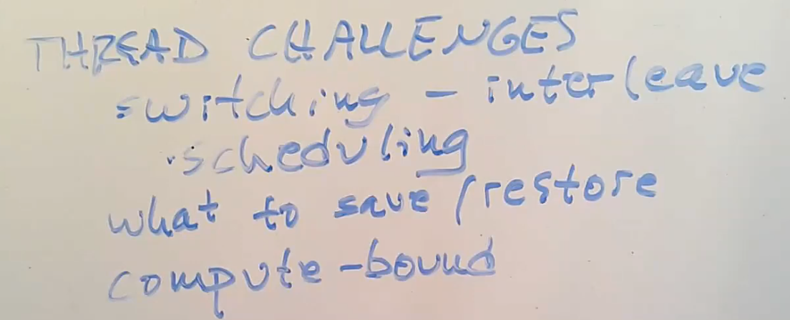

# 11.2 XV6线程调度

实现内核中的线程系统存在以下挑战：

* 第一个是如何实现线程间的切换。这里停止一个线程的运行并启动另一个线程的过程通常被称为线程调度（Scheduling）。我们将会看到XV6为每个CPU核都创建了一个线程调度器（Scheduler）。
* 第二个挑战是，当你想要实际实现从一个线程切换到另一个线程时，你需要保存并恢复线程的状态，所以需要决定线程的哪些信息是必须保存的，并且在哪保存它们。
* 最后一个挑战是如何处理运算密集型线程（compute bound thread）。对于线程切换，很多直观的实现是由线程自己自愿的保存自己的状态，再让其他的线程运行。但是如果我们有一些程序正在执行一些可能要花费数小时的长时间计算任务，这样的线程并不能自愿的出让CPU给其他的线程运行。所以这里需要能从长时间运行的运算密集型线程撤回对于CPU的控制，将其放置于一边，稍后再运行它。

