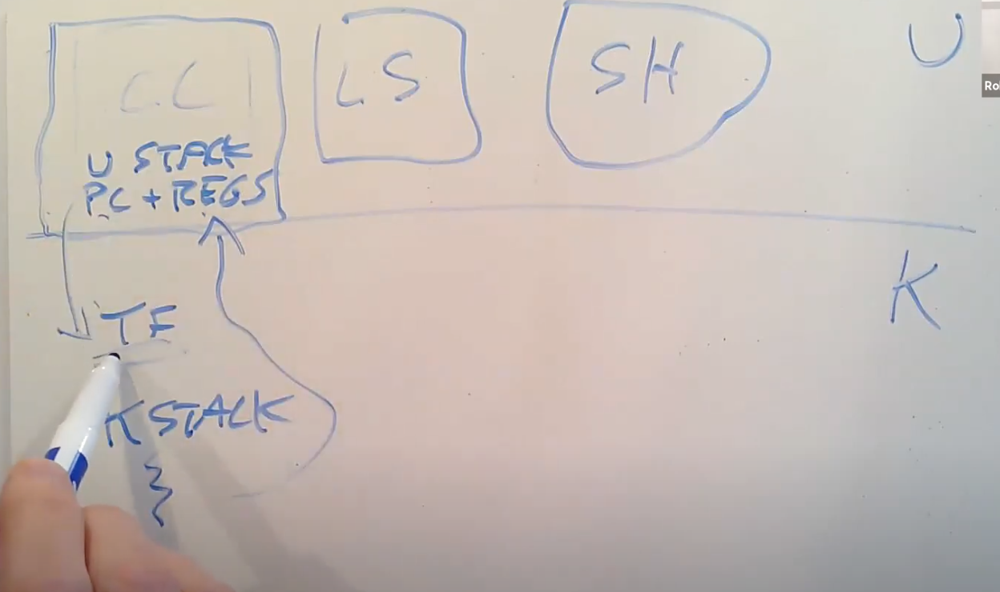

# 11.3 XV6线程切换（一）

接下来我将通过两张图来介绍XV6中的线程切换是如何实现的，其中一张图是简单的，另一张图包含了更多的细节，这一小节先看简单的图。

我们或许会运行多个用户空间进程，例如C compiler（CC），LS，Shell，它们或许会，也或许不会想要同时运行。在用户空间，每个进程有自己的内存，对于我们这节课来说，我们更关心的是每个进程都包含了一个用户程序栈（user stack），并且当进程运行的时候，它在RISC-V处理器中会有程序计数器和寄存器。当用户程序在运行时，实际上是用户进程中的一个用户线程在运行。如果程序执行了一个系统调用或者因为响应中断走到了内核中，那么相应的用户空间状态会被保存在程序的trapframe中（注，详见lec06），同时属于这个用户程序的内核线程被激活。所以首先，用户的程序计数器，寄存器等等被保存到了trapframe中，之后CPU被切换到内核栈上运行，实际上会走到trampoline和usertrap代码中（注，详见lec06）。之后内核会运行一段时间处理系统调用或者执行中断处理程序。在处理完成之后，如果需要返回到用户空间，trapframe中保存的用户进程状态会被恢复。

