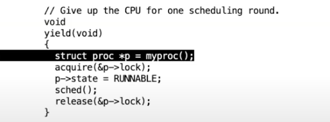

# 11.6 XV6线程切换 --- yield/sched函数

回到devintr函数返回到usertrap函数中的位置。在gdb里面输入几次step走到yield函数的调用。yield函数是整个线程切换的第一步，下面是yield函数的内容：

 (2) (2) (2) (1).png>)

可以看出，sched函数基本没有干任何事情，只是做了一些合理性检查，如果发现异常就panic。为什么会有这么多检查？因为这里的XV6代码已经有很多年的历史了，这些代码经历过各种各样的bug，相应的这里就有各种各样的合理性检查和panic来避免可能的bug。我将跳过所有的检查，直接走到位于底部的swtch函数。
