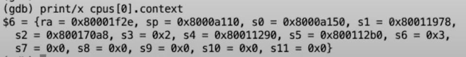

# 11.7 XV6线程切换 --- switch函数

 (2) (2) (2).png>)

swtch函数会将当前的内核线程的寄存器保存到p->context中。swtch函数的另一个参数c->context，c表示当前CPU的结构体。CPU结构体中的context保存了当前CPU核的调度器线程的寄存器。所以swtch函数在保存完当前内核线程的内核寄存器之后，就会恢复当前CPU核的调度器线程的寄存器，并继续执行当前CPU核的调度器线程。

接下来，我们快速的看一下我们将要切换到的context（注，也就是调度器线程的context）。因为我们只有一个CPU核，这里我在gdb中print cpus\[0].context

