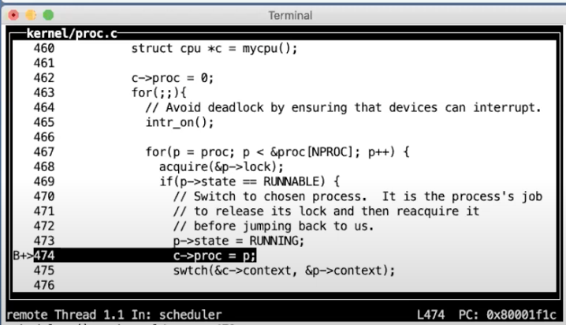

# 11.8 XV6线程切换 --- scheduler函数

来看一下scheduler的完整代码，

 (2).png>)

现在我们正运行在CPU拥有的调度器线程中，并且我们正好在之前调用swtch函数的返回状态。之前调度器线程调用switch是因为想要运行pid为3的进程，也就是刚刚被中断的spin程序。

虽然pid为3的spin进程也调用了swtch函数，但是那个switch并不是当前返回的这个switch。spin进程调用的swtch函数还没有返回，而是保存在了pid为3的栈和context对象中。现在返回的是之前调度器线程对于swtch函数的调用。

在scheduler函数中，因为我们已经停止了spin进程的运行，所以我们需要抹去对于spin进程的记录。我们接下来将c->proc设置为0（c->proc = 0;）。因为我们现在并没有在这个CPU核上运行这个进程，为了不让任何人感到困惑，我们这里将CPU核运行的进程对象设置为0。

之前在yield函数中获取了进程的锁，因为yield不想进程完全进入到Sleep状态之前，任何其他的CPU核的调度器线程看到这个进程并运行它。而现在我们完成了从spin进程切换走，所以现在可以释放锁了。这就是release(\&p->lock)的意义。现在，我们仍然在scheduler函数中，但是其他的CPU核可以找到spin进程，并且因为spin进程是RUNABLE状态，其他的CPU可以运行它。这没有问题，因为我们已经完整的保存了spin进程的寄存器，并且我们不在spin进程的栈上运行程序，而是在当前CPU核的调度器线程栈上运行程序，所以其他的CPU核运行spin程序并没有问题。但是因为启动QEMU时我们只指定了一个核，所以在我们现在的演示中并没有其他的CPU核来运行spin程序。

接下来我将简单介绍一下p->lock。从调度的角度来说，这里的锁完成了两件事情。

首先，出让CPU涉及到很多步骤，我们需要将进程的状态从RUNNING改成RUNABLE，我们需要将进程的寄存器保存在context对象中，并且我们还需要停止使用当前进程的栈。所以这里至少有三个步骤，而这三个步骤需要花费一些时间。所以锁的第一个工作就是在这三个步骤完成之前，阻止任何一个其他核的调度器线程看到当前进程。锁这里确保了三个步骤的原子性。从CPU核的角度来说，三个步骤要么全发生，要么全不发生。

第二，当我们开始要运行一个进程时，p->lock也有类似的保护功能。当我们要运行一个进程时，我们需要将进程的状态设置为RUNNING，我们需要将进程的context移到RISC-V的寄存器中。但是，如果在这个过程中，发生了中断，从中断的角度来说进程将会处于一个奇怪的状态。比如说进程的状态是RUNNING，但是又还没有将所有的寄存器从context对象拷贝到RISC-V寄存器中。所以，如果这时候有了一个定时器中断将会是个灾难，因为我们可能在寄存器完全恢复之前，从这个进程中切换走。而从这个进程切换走的过程中，将会保存不完整的RISC-V寄存器到进程的context对象中。所以我们希望启动一个进程的过程也具有原子性。在这种情况下，切换到一个进程的过程中，也需要获取进程的锁以确保其他的CPU核不能看到这个进程。同时在切换到进程的过程中，还需要关闭中断，这样可以避免定时器中断看到还在切换过程中的进程。（注，这就是为什么468行需要加锁的原因）

现在我们在scheduler函数的循环中，代码会检查所有的进程并找到一个来运行。现在我们知道还有另一个进程，因为我们之前fork了另一个spin进程。这里我跳过进程检查，直接在找到RUNABLE进程的位置设置一个断点。

