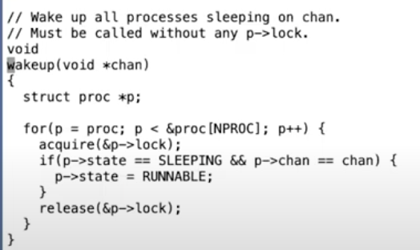

# 13.4 如何避免Lost wakeup

现在我们的目标是消灭掉lost wakeup。这可以通过消除下面的窗口时间来实现。

 (1) (1) (1) (1).png>)

首先我们必须要释放uart\_tx\_lock锁，因为中断需要获取这个锁，但是我们又不能在释放锁和进程将自己标记为SLEEPING之间留有窗口。这样中断处理程序中的wakeup才能看到SLEEPING状态的进程，并将其唤醒，进而我们才可以避免lost wakeup的问题。所以，我们应该消除这里的窗口。

为了实现这个目的，我们需要将sleep函数设计的稍微复杂点。这里的解决方法是，即使sleep函数不需要知道你在等待什么事件，它还是需要你知道你在等待什么数据，并且传入一个用来保护你在等待数据的锁。sleep函数需要特定的条件才能执行，而sleep自己又不需要知道这个条件是什么。在我们的例子中，sleep函数执行的特定条件是tx\_done等于1。虽然sleep不需要知道tx\_done，但是它需要知道保护这个条件的锁，也就是这里的uart\_tx\_lock。在调用sleep的时候，锁还被当前线程持有，之后这个锁被传递给了sleep。

在接口层面，sleep承诺可以原子性的将进程设置成SLEEPING状态，同时释放锁。这样wakeup就不可能看到这样的场景：锁被释放了但是进程还没有进入到SLEEPING状态。所以sleep这里将释放锁和设置进程为SLEEPING状态这两个行为合并为一个原子操作。

所以我们需要有一个锁来保护sleep的条件，并且这个锁需要传递给sleep作为参数。更进一步的是，当调用wakeup时，锁必须被持有。如果程序员想要写出正确的代码，都必须遵守这些规则来使用sleep和wakeup。

接下来我们看一下sleep和wakeup如何使用这一小块额外的信息（注，也就是传入给sleep函数的锁）和刚刚提到的规则，来避免lost wakeup。

首先我们来看一下proc.c中的wakeup函数。

