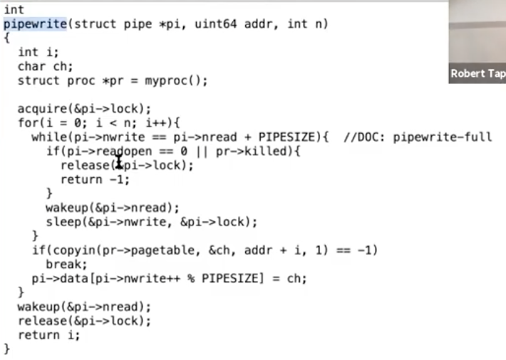

# 13.5 Pipe中的sleep和wakeup

前面我们介绍了在UART的驱动中，如何使用sleep和wakeup才能避免lost wakeup。前面这个特定的场景中，sleep等待的condition是发生了中断并且硬件准备好了传输下一个字符。在一些其他场景，内核代码会调用sleep函数并等待其他的线程完成某些事情。这些场景从概念上来说与我们介绍之前的场景没有什么区别，但是感觉上还是有些差异。例如，在读写pipe的代码中，如果你查看pipe.c中的piperead函数，

 (1).png>)

这里有很多无关的代码可以忽略。当read系统调用最终调用到piperead函数时，pi->lock会用来保护pipe，这就是sleep函数对应的condition lock。piperead需要等待的condition是pipe中有数据，而这个condition就是pi->nwrite大于pi->nread，也就是写入pipe的字节数大于被读取的字节数。如果这个condition不满足，那么piperead会调用sleep函数，并等待condition发生。同时piperead会将condition lock也就是pi->lock作为参数传递给sleep函数，以确保不会发生lost wakeup。

之所以会出现lost wakeup，是因为在一个不同的CPU核上可能有另一个线程刚刚调用了pipewrite。

