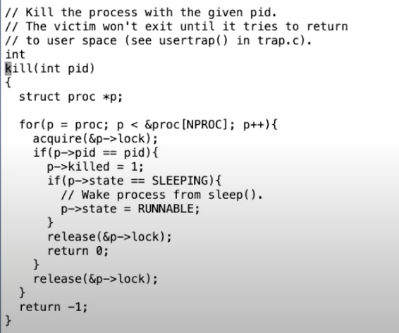
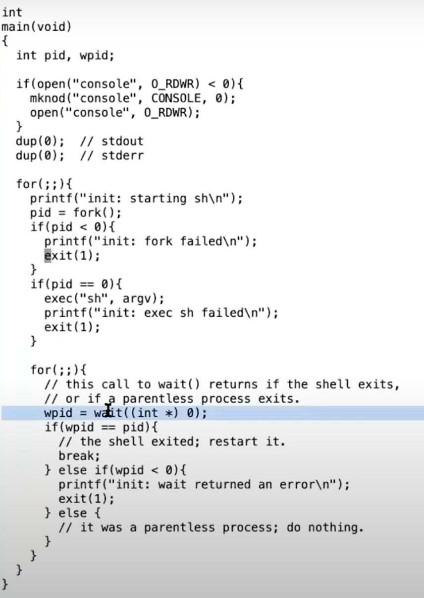

# 13.8 kill系统调用

最后我想看的是kill系统调用。Unix中的一个进程可以将另一个进程的ID传递给kill系统调用，并让另一个进程停止运行。如果我们不够小心的话，kill一个还在内核执行代码的进程，会有一些我几分钟前介绍过的风险，比如我们想要杀掉的进程的内核线程还在更新一些数据，比如说更新文件系统，创建一个文件。如果这样的话，我们不能就这样杀掉进程，因为这样会使得一些需要多步完成的操作只执行了一部分。所以kill系统调用不能就直接停止目标进程的运行。实际上，在XV6和其他的Unix系统中，kill系统调用基本上不做任何事情。

如果一个进程正在sleep状态等待从pipe中读取数据，然后它被kill了。kill函数会将其设置为RUNNABLE，之后进程会从sleep中返回，返回到循环的最开始。pipe中大概率还是没有数据，之后在piperead中，会判断进程是否被kill了（注，if(pr->killed)）。如果进程被kill了，那么接下来piperead会返回-1，并且返回到usertrap函数的syscall位置，因为piperead就是一种系统调用的实现。

之后在usertrap函数中会检查p->killed，并调用exit。

所以对于SLEEPING状态的进程，如果它被kill了，它会被直接唤醒，包装了sleep的循环会检查进程的killed标志位，最后再调用exit。

同时还有一些情况，如果进程在SLEEPING状态中被kill了并不能直接退出。例如，一个进程正在更新一个文件系统并创建一个文件的过程中，进程不适宜在这个时间点退出，因为我们想要完成文件系统的操作，之后进程才能退出。我会向你展示一个磁盘驱动中的sleep循环，这个循环中就没有检查进程的killed标志位。

下面就是virtio\_disk.c文件中的一段代码：

 (1) (1).png>)

这里一个进程正在等待磁盘的读取结束，这里没有检查进程的killed标志位。因为现在可能正在创建文件的过程中，而这个过程涉及到多次读写磁盘。我们希望完成所有的文件系统操作，完成整个系统调用，之后再检查p->killed并退出。

> 学生提问：为什么一个进程允许kill另一个进程？这样一个进程不是能杀掉所有其他进程吗？
>
> Robert教授：如果你在MIT的分时复用计算机Athena上这么做的话，他们可能会开除你。在XV6中允许这么做是因为，XV6这是个教学用的操作系统，任何与权限相关的内容在XV6中都不存在。在Linux或者真正的操作系统中，每个进程都有一个user id或多或少的对应了执行进程的用户，一些系统调用使用进程的user id来检查进程允许做的操作。所以在Linux中会有额外的检查，调用kill的进程必须与被kill的进程有相同的user id，否则的话，kill操作不被允许。所以，在一个分时复用的计算机上，我们会有多个用户，我们不会想要用户kill其他人的进程，这样一套机制可以防止用户误删别人的进程。
>
> 学生提问：init进程会退出吗？
>
> Robert教授：让我来看看。

