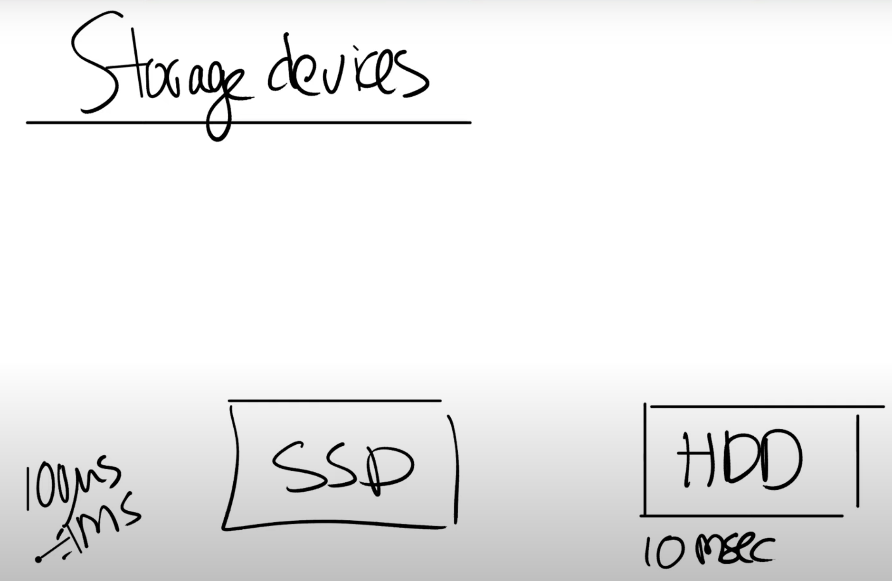

# 14.3 How file system uses disk

接下来，我将简单的介绍最底层，也即是存储设备。实际中有非常非常多不同类型的存储设备，这些设备的区别在于性能，容量，数据保存的期限等。其中两种最常见，并且你们应该也挺熟悉的是SSD和HDD。这两类存储虽然有着不同的性能，但是都在合理的成本上提供了大量的存储空间。SSD通常是0.1到1毫秒的访问时间，而HDD通常是在10毫秒量级完成读写一个disk block。

