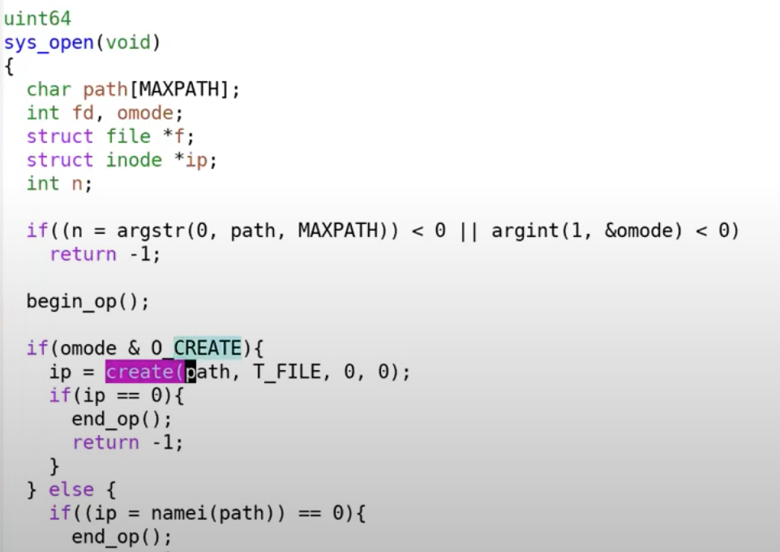
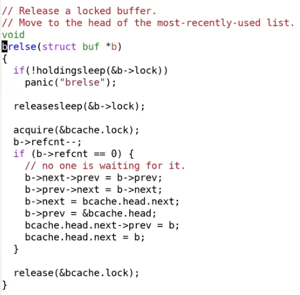

# 14.6 XV6创建inode代码展示

接下来我们通过查看XV6中的代码，更进一步的了解文件系统。因为我们前面已经分配了inode，我们先来看一下这是如何发生的。sysfile.c中包含了所有与文件系统相关的函数，分配inode发生在sys\_open函数中，这个函数会负责创建文件。

之后，b->refcnt都大于0。block的cache只会在refcnt为0的时候才会被驱逐，任何时候refcnt大于0都不会驱逐block cache。所以当b->refcnt大于0的时候，block cache本身不会被buffer cache修改。这里的第二个锁，也就是block cache的sleep lock，是用来保护block cache的内容的。它确保了任何时候只有一个进程可以读写block cache。

如果buffer cache中有两份block 33的cache将会出现问题。假设一个进程要更新inode19，另一个进程要更新inode20。如果它们都在处理block 33的cache，并且cache有两份，那么第一个进程可能持有一份cache并先将inode19写回到磁盘中，而另一个进程持有另一份cache会将inode20写回到磁盘中，并将inode19的更新覆盖掉。所以一个block只能在buffer cache中出现一次。你们在完成File system lab时，必须要维持buffer cache的这个属性。

> 学生提问：如果多个进程都在使用同一个block的cache，然后有一个进程在修改block，并通过强制向磁盘写数据修改了block的cache，那么其他进程会看到什么结果？
>
> Frans教授：如果第一个进程结束了对block 33的读写操作，它会对block的cache调用brelse（block cache release）函数。

