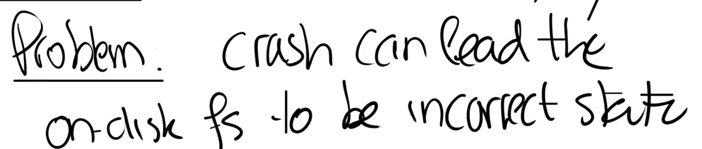

# 15.1 File system crash概述

（00:00 - 06:23，是在对Lock lab提问，与本节课无关故略过）

今天的课程是有关文件系统中的Crash safety。这里的Crash safety并不是一个通用的解决方案，而是只关注一个特定的问题的解决方案，也就是crash或者电力故障可能会导致在磁盘上的文件系统处于不一致或者不正确状态的问题。当我说不正确的状态时，是指例如一个data block属于两个文件，或者一个inode被分配给了两个不同的文件。

