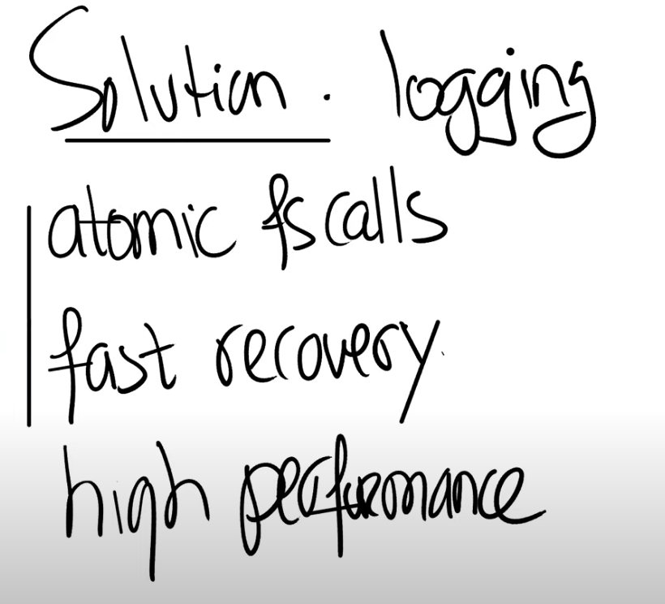

# 15.3 File system logging

我们这节课要讨论的针对文件系统crash之后的问题的解决方案，其实就是logging。这是来自于数据库的一种解决方案。它有一些好的属性：

* 首先，它可以确保文件系统的系统调用是原子性的。比如你调用create/write系统调用，这些系统调用的效果是要么完全出现，要么完全不出现，这样就避免了一个系统调用只有部分写磁盘操作出现在磁盘上。
* 其次，它支持快速恢复（Fast Recovery）。在重启之后，我们不需要做大量的工作来修复文件系统，只需要非常小的工作量。这里的快速是相比另一个解决方案来说，在另一个解决方案中，你可能需要读取文件系统的所有block，读取inode，bitmap block，并检查文件系统是否还在一个正确的状态，再来修复。而logging可以有快速恢复的属性。
* 最后，原则上来说，它可以非常的高效，尽管我们在XV6中看到的实现不是很高效。

我们会在下节课看一下，如何构建一个logging系统，并同时具有原子性的系统调用，快速恢复和高性能，而今天，我们只会关注前两点。

