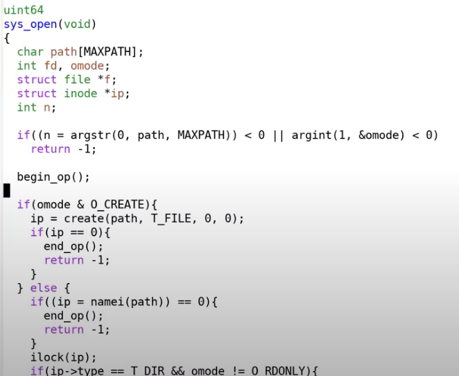

# 15.4 log\_write函数

接下来让我们看一些代码来帮助我们理解这里是怎么工作的。前面我提过事务（transaction），也就是我们不应该在所有的写操作完成之前写入commit record。这意味着文件系统操作必须表明事务的开始和结束。在XV6中，以创建文件的sys\_open为例（在sysfile.c文件中）每个文件系统操作，都有begin\_op和end\_op分别表示事物的开始和结束。

