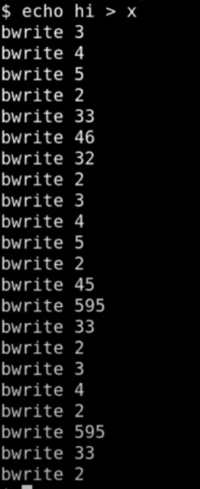

# 15.7 Log写磁盘流程

我已经在bwrite函数中加了一个print语句。bwrite函数是block cache中实际写磁盘的函数，所以我们将会看到实际写磁盘的记录。在上节课（Lec 14）我将print语句放在了log\_write中，log\_write只能代表文件系统操作的记录，并不能代表实际写磁盘的记录。我们这里会像上节课一样执行echo "hi" > x，并看一下实际的写磁盘过程。

