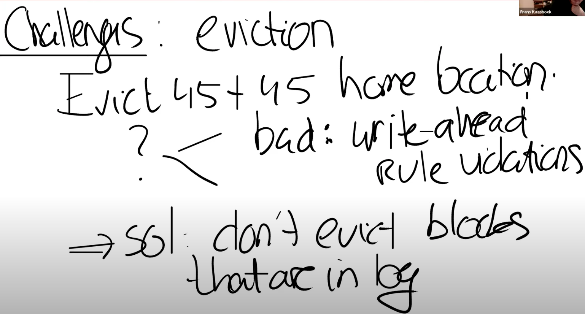

# 15.8 File system challenges

前面说到XV6的文件系统有一定的复杂性，接下来我将介绍一下三个复杂的地方或者也可以认为是三个挑战。

第一个是cache eviction。假设transaction还在进行中，我们刚刚更新了block 45，正要更新下一个block，而整个buffer cache都满了并且决定撤回block 45。在buffer cache中撤回block 45意味着我们需要将其写入到磁盘的block 45位置，这里会不会有问题？如果我们这么做了的话，会破坏什么规则吗？是的，如果将block 45写入到磁盘之后发生了crash，就会破坏transaction的原子性。这里也破坏了前面说过的write ahead rule，write ahead rule的含义是，你需要先将所有的block写入到log中，之后才能实际的更新文件系统block。所以buffer cache不能撤回任何还位于log的block。

前面在介绍log\_write函数时，其中调用了一个叫做bpin的函数，这个函数的作用就如它的名字一样，将block固定在buffer cache中。它是通过给block cache增加引用计数来避免cache撤回对应的block。在之前（注，详见14.6）我们看过，如果引用计数不为0，那么buffer cache是不会撤回block cache的。相应的在将来的某个时间，所有的数据都写入到了log中，我们可以在cache中unpin block（注，在15.5中的install\_trans函数中会有unpin，因为这时block已经写入到了log中）。所以这是第一个复杂的地方，我们需要pin/unpin buffer cache中的block。

