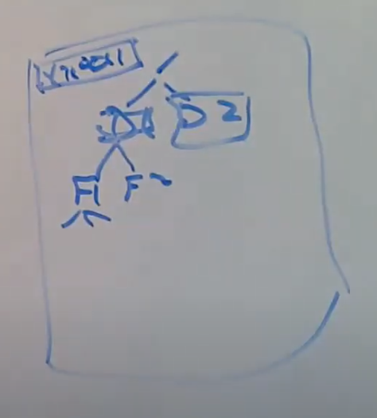

# 16.2 XV6 File system logging回顾

首先来回顾一下XV6的logging系统。我们有一个磁盘用来存储XV6的文件系统，你可以认为磁盘分为了两个部分：

* 首先是文件系统目录的树结构，以root目录为根节点，往下可能有其他的目录，我们可以认为目录结构就是一个树状的数据结构。假设root目录下有两个子目录D1和D2，D1目录下有两个文件F1和F2，每个文件又包含了一些block。除此之外，还有一些其他并非是树状结构的数据，比如bitmap表明了每一个data block是空闲的还是已经被分配了。inode，目录内容，bitmap block，我们将会称之为metadata block（注，Frans和Robert在这里可能有些概念不统一，对于Frans来说，目录内容应该也属于文件内容，目录是一种特殊的文件，详见14.3；而对于Robert来说，目录内容是metadata。），另一类就是持有了文件内容的block，或者叫data block。

