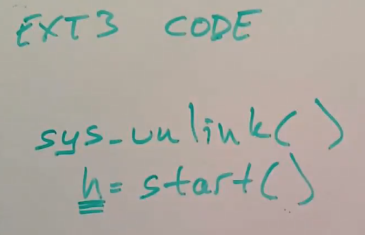

# 16.5 ext3文件系统调用格式

接下来我们大概过一下Linux中的文件系统调用，并介绍抽象上每个系统调用的结构。

在Linux的文件系统中，我们需要每个系统调用都声明一系列写操作的开始和结束。实际上在任何transaction系统中，都需要明确的表示开始和结束，这样之间的所有内容都是原子的。所以系统调用中会调用start函数。ext3需要知道当前正在进行的系统调用个数，所以每个系统调用在调用了start函数之后，会得到一个handle，它某种程度上唯一识别了当前系统调用。当前系统调用的所有写操作都是通过这个handle来识别跟踪的（注，handle是ext3 transaction中的一部分数据，详见16.3）。

